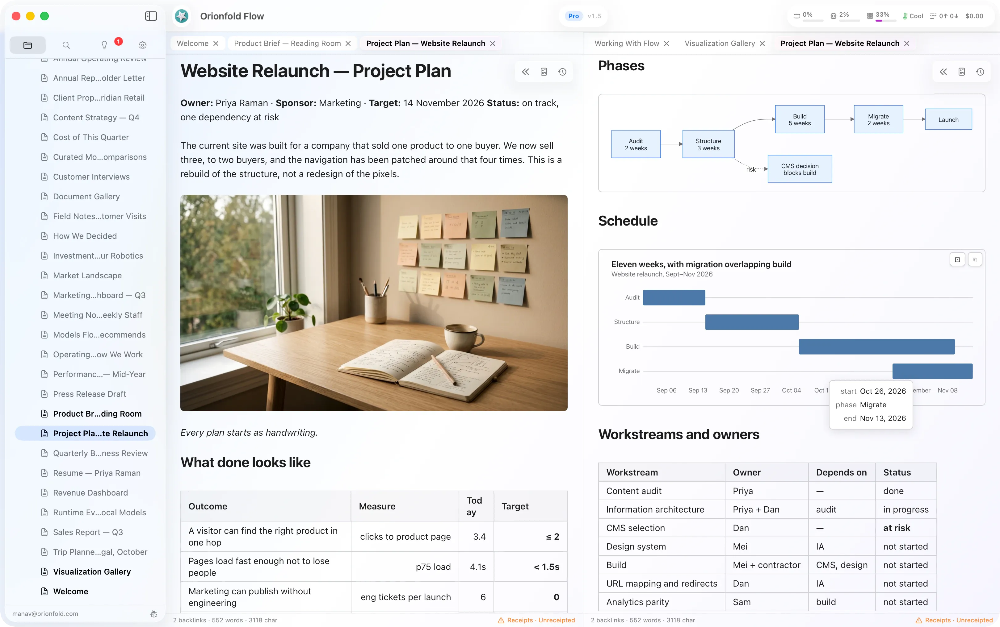

# Orionfold Flow

**AI proposes each change. You approve it.**

Flow is a native Mac app for professional documents with AI agency built in.
It works on ordinary folders of plain Markdown files. Every AI change arrives
as an exact diff you approve, and a receipt records what ran, where it ran,
and what it cost.

### [Download Flow Now →](https://orionfold.com/flow/)

Apple Mac. 10 Pro Days included. No credit card to use.
macOS 26 or later, Apple silicon or Intel.

## Your documents are free forever. The AI is what you pay for.

Reading, writing, searching, organizing and exporting are free forever. Flow's
AI features are $10 a month, or $96 a year. One licence covers one person on
their own Macs. If the subscription ends, the AI stops and the documents remain
open and editable.

## What Flow does

**See the change before it becomes yours.** Flow proposes an exact diff. You
can approve it, reject it, or keep reviewing. Your document changes only when
you say so. [See writing with AI →](https://orionfold.com/flow/writing-with-ai/)

**Turn plain text into finished visuals.** Choose from 34 chart types and 20
diagram types. Flow draws them in place, offline, from readable text that stays
in your file. [See documents and files →](https://orionfold.com/flow/documents-and-files/)

**Choose where every model may run.** Allow AI on your Mac, your network, or
the cloud accounts you already use. If a fallback would cross a boundary, Flow
asks first. [See models and runtime →](https://orionfold.com/flow/models-and-runtime/)

**Keep the proof with the work.** Every approved run leaves a receipt with the
model, route, cost, checks, evidence, and the revision you chose to keep.
[See receipts and evidence →](https://orionfold.com/flow/receipts/)

## Does my text leave my Mac?

Only if you allow it. Flow separates where AI may run into four switchable
domains: Local, LAN, Cloud prepaid, and Cloud postpaid. Search is on-device,
and a fallback that would leave your Mac stops and asks first. Flow runs on
your Mac with no tracking, no usage statistics, no analytics code, and no
licence check-ins, and it sends no crash reports. The Flow Guide prints the
whole list of times Flow reaches the network, with what is sent and your switch
beside each line. [Privacy](https://orionfold.com/privacy/) ·
[Promise](https://orionfold.com/promise/)

## What this repository is

This is the **Flow Guide**: the folder of documents Flow opens on first launch,
published here so Flow can keep it current. In Flow, **Settings ▸ Flow System ▸
Flow Guide Updates…** fetches the newest documents from this repository and
asks before it changes anything of yours. [`flow-guide/Changelog.md`](flow-guide/Changelog.md)
is what is new in each release: what shipped, how it benefits you, and how to
use it.

The app's source code is not here. Flow is a direct download for Mac, signed
and notarized, outside the App Store.

## Feedback

Open an issue here: [github.com/orionfold/flow/issues](https://github.com/orionfold/flow/issues).
In Flow, *Help ▸ Issue or Feature Request* opens the form with your Flow
version filled in, and *Help ▸ Copy Diagnostics…* puts a short block on your
clipboard to paste under it. You see the text first; nothing is sent until you
paste it.

## More

[Tour](https://orionfold.com/flow/tour/) ·
[Tech Specs](https://orionfold.com/flow/specifications/) ·
[Enterprise](https://orionfold.com/flow/enterprise/)

Current release: Flow 1.6 (1899).
