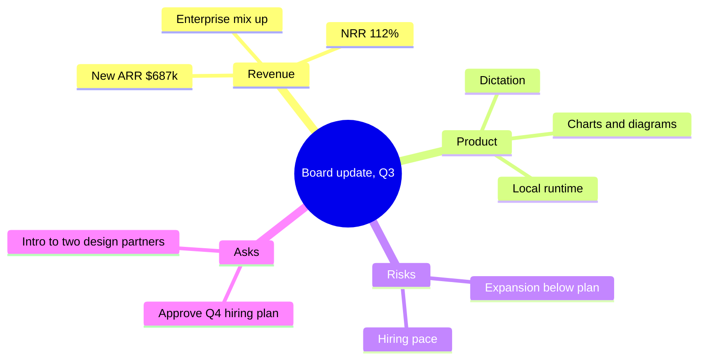
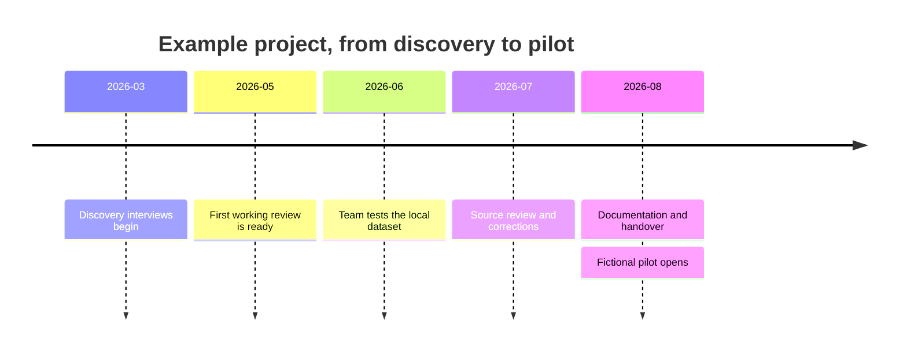
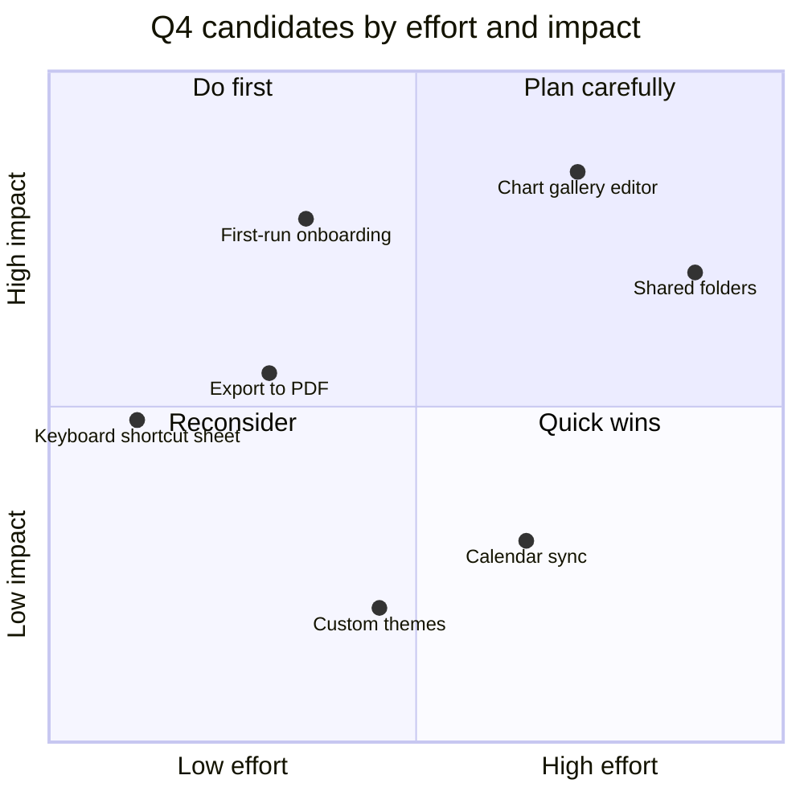
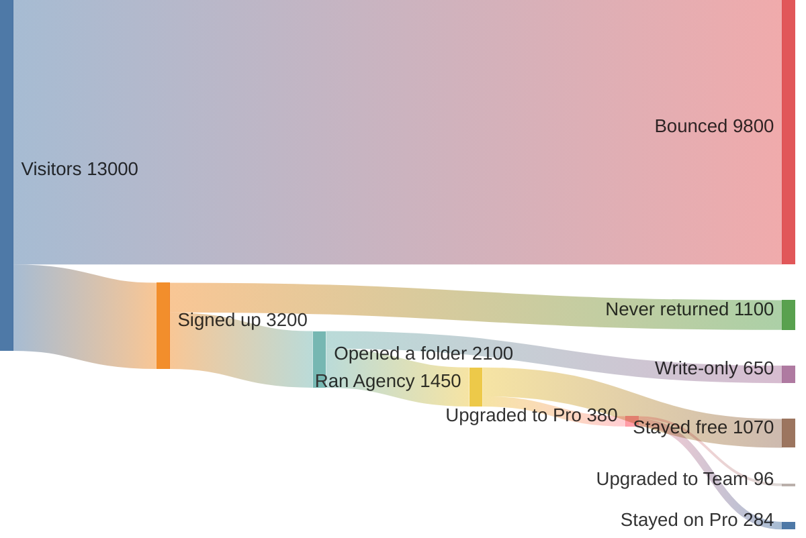
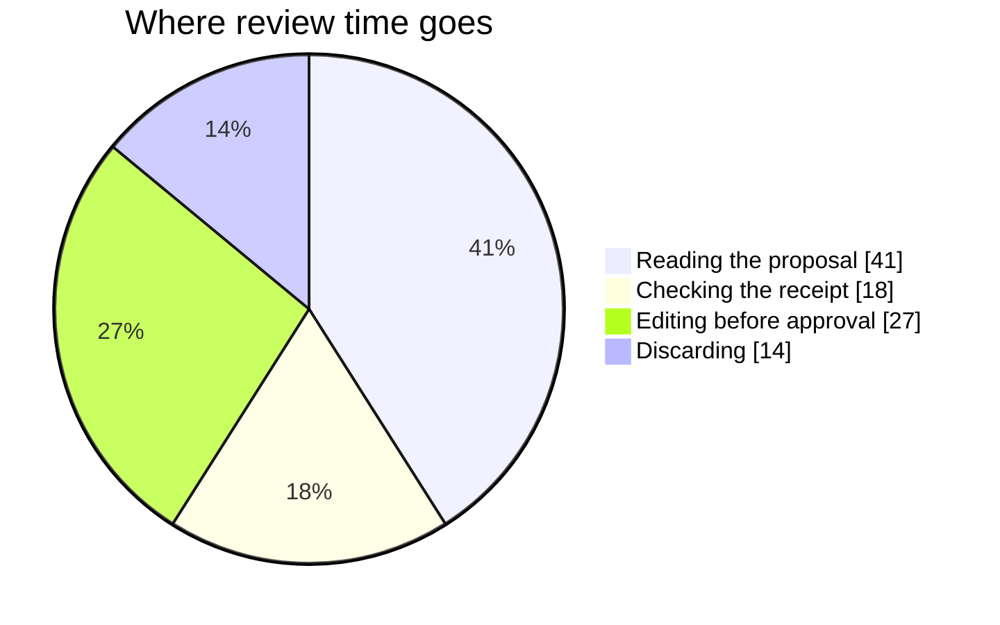
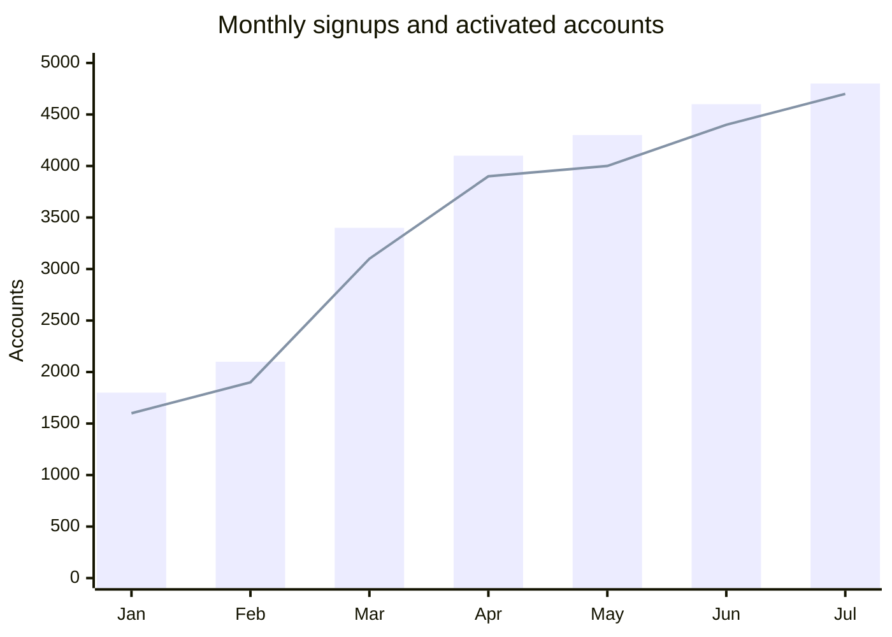
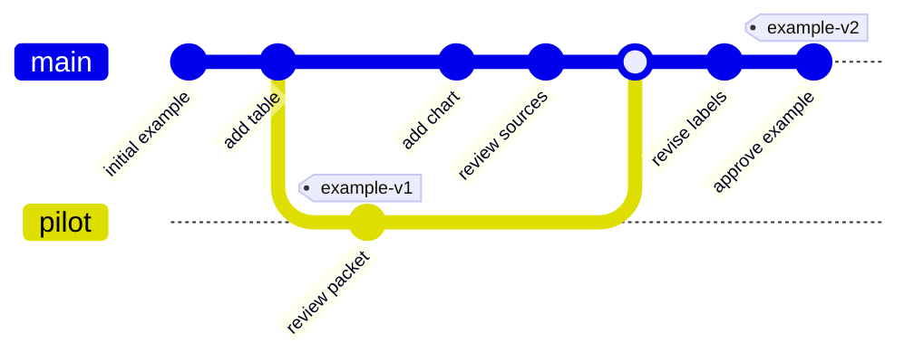

# Diagrams — Connections

[[Charts Gallery]] · Previous: [[Diagrams — Structures]] · Next: [[Charts Gallery]]

**Organize ideas, events and quantitative flows.**

> Every exhibit on this page uses fictional teaching data or an authored scenario. Source labels describe the example; they are not reports, measured Flow benchmarks or product guarantees.

| Form | Use it for |
| --- | --- |
| Mindmap | Turn a nested outline into a navigable conceptual structure |
| Timeline | Present dated milestones in order |
| Quadrant chart | Discuss items scored on two explicit axes |
| Sankey diagram | Follow amounts between named stages |
| Pie (Mermaid) | Show a few embedded amounts within a Mermaid document |
| XY chart (Mermaid) | Combine simple embedded bar and line series using one explained axis |
| Git graph | Explain a small branch-and-merge history |

An outline, a chronology and a numerical flow should not share a form merely because all contain connections.

## The exhibits

### Mindmap

Turn a nested outline into a navigable conceptual structure. Branches are authored associations, not an automatically maintained knowledge graph.

Source: an outline, a nested bulleted list of topics and subtopics, such as meeting notes, a brainstorm, or a document's structure.

[[Charts Gallery]]

### Timeline

Present dated milestones in order. Distinguish planned dates from observed events and do not treat this fictional history as a Flow release record.

Source: a list of dated events: a company history, a release log, an incident's sequence.

[[Charts Gallery]]

### Quadrant chart

Discuss items scored on two explicit axes. The placement is a judgment to review; a quadrant label is not a prioritization algorithm.

Source: a list of items each rated on two axes, such as effort and impact, risk and reward or urgency and importance, the prioritisation matrix.

[[Charts Gallery]]

### Sankey diagram

Follow amounts between named stages. Check units and flow conservation; these numbers are embedded in the diagram and do not update from a source table.

Source: a table of source, target and amount: where traffic, money or people flow from one stage to the next, such as a funnel or an energy balance.

[[Charts Gallery]]

### Pie (Mermaid)

Show a few embedded amounts within a Mermaid document. It is authored data; the chart-fence pie is the choice here when values must bind to a local source.

Source: a short list of labels and amounts: the same material as a chart pie, when you want it inside a diagram-only document or rendered on GitHub.

[[Charts Gallery]]

### XY chart (Mermaid)

Combine simple embedded bar and line series using one explained axis. Keep units compatible and identify each series in the surrounding prose.

Source: a date-and-value table when the document must render on GitHub as well as in Flow: a bar-plus-line over months without the chart fence. Bars show signups; the line shows activated accounts. Both use account counts, not percentages.

[[Charts Gallery]]

### Git graph

Explain a small branch-and-merge history. The commits below are fictional labels; the diagram does not inspect or operate a repository.

Source: a description of branches, merges and releases: a release process, or how a feature landed.

[[Charts Gallery]]

## Use a form with your own records

Copy the whole **Charts Gallery** folder and add that copy to Flow first. Open [[Gallery Data]] to practise with a table you can edit. [[Charts — Living Example]] shows the refresh path. These reference exhibits keep their own embedded examples; they do not change when the practice table changes.

For a new exhibit, open a suitable example in the chart editor or select your own source rows and use Visualize. Keep the units and source explanation with the result. Visualize uses your configured Agency route; inspect its proposal before applying. Authored Mermaid diagrams need deliberate text edits; they are not automatically maintained from the table.

[[Charts Gallery]] · Previous: [[Diagrams — Structures]] · Next: [[Charts Gallery]]
