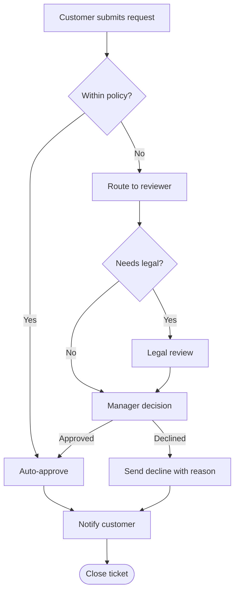
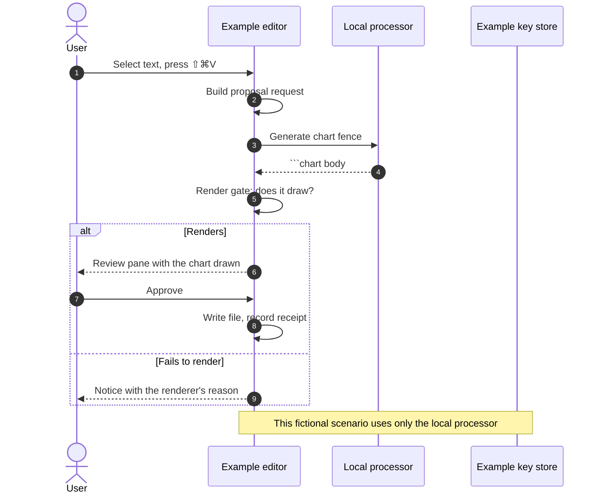
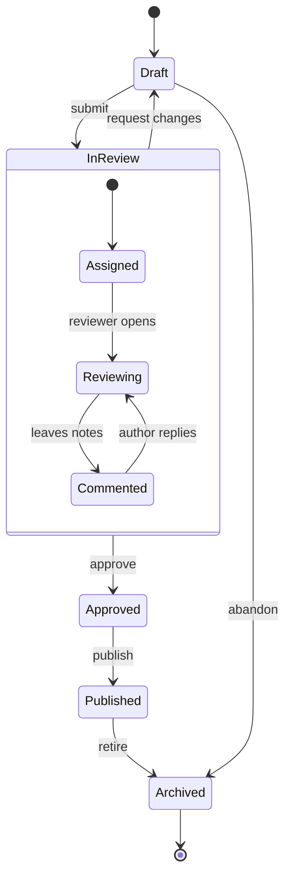
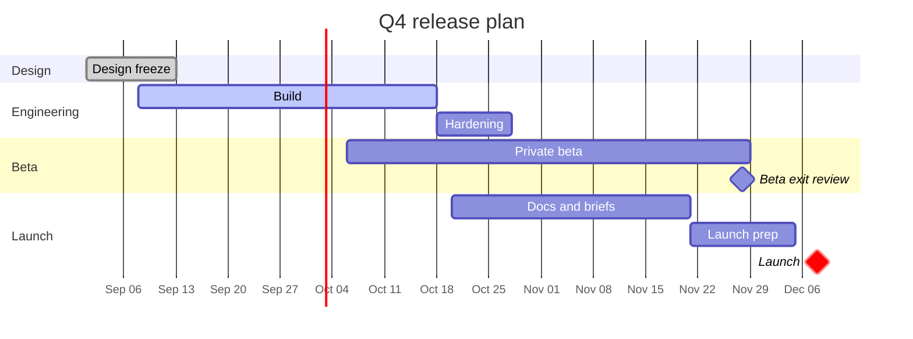
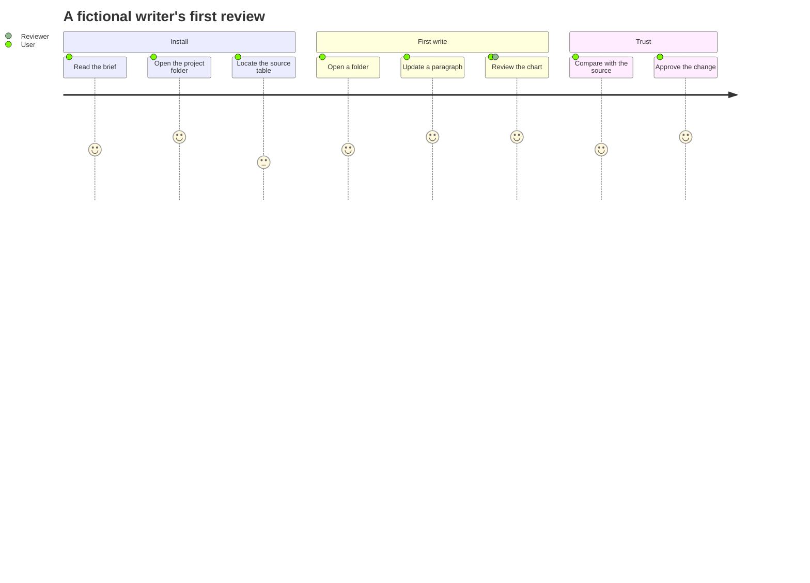
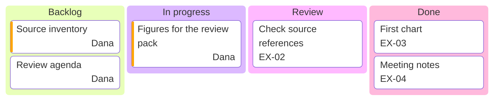

# Diagrams — Processes

[[Charts Gallery]] · Previous: [[Charts — Patterns]] · Next: [[Diagrams — Structures]]

**Explain what happens, who acts and what changes state.**

> Every exhibit on this page uses fictional teaching data or an authored scenario. Source labels describe the example; they are not reports, measured Flow benchmarks or product guarantees.

| Form | Use it for |
| --- | --- |
| Flowchart | Explain steps and decisions, including the paths a person can take |
| Sequence diagram | Show actors exchanging messages in order |
| State diagram | Define allowed states and the events between them |
| Gantt (Mermaid) | Write a dependency-oriented schedule as text |
| User journey | Summarize a sequence of tasks and an explicitly subjective experience rating |
| Kanban board | Group an authored task list by status |

Choose sequence for exchanges, state for permitted transitions and a flowchart for decisions. They explain different aspects of a process.

## The exhibits

### Flowchart

Explain steps and decisions, including the paths a person can take. Treat arrows as an authored process; they do not execute an approval or send a message.

Source: a numbered list of steps with decisions written as questions: a process, an approval path, a troubleshooting guide.

[[Charts Gallery]]

### Sequence diagram

Show actors exchanging messages in order. Name the boundary and failure path; the diagram is a scenario, not a trace captured from a live system.

Source: prose or a list describing who sends what to whom, in order: an integration, a support escalation, an approval exchange between people or systems.

[[Charts Gallery]]

### State diagram

Define allowed states and the events between them. Keep state names distinct from actions and account for endings or reversals.

Source: a list of states and the events that move between them: a document lifecycle, an order status, a subscription.

[[Charts Gallery]]

### Gantt (Mermaid)

Write a dependency-oriented schedule as text. This example is separate from the chart Gantt; neither proves a planned task completed.

Source: a list of tasks with durations and dependencies, in sections: a project plan written as prose, when you want milestones and "after X" dependencies rather than fixed dates.

[[Charts Gallery]]

### User journey

Summarize a sequence of tasks and an explicitly subjective experience rating. Say whose experience the ratings describe; this sample is not a user-research result.

Source: a walkthrough of what a person does, step by step, with how each step felt: research synthesis, a support transcript, an onboarding review.

[[Charts Gallery]]

### Kanban board

Group an authored task list by status. Moving a card in text changes this document; it does not update an external project-management system.

Source: a task list grouped by status: the sprint board as columns of cards with owners.

[[Charts Gallery]]

## Use a form with your own records

Copy the whole **Charts Gallery** folder and add that copy to Flow first. Open [[Gallery Data]] to practise with a table you can edit. [[Charts — Living Example]] shows the refresh path. These reference exhibits keep their own embedded examples; they do not change when the practice table changes.

For a new exhibit, open a suitable example in the chart editor or select your own source rows and use Visualize. Keep the units and source explanation with the result. Visualize uses your configured Agency route; inspect its proposal before applying. Authored Mermaid diagrams need deliberate text edits; they are not automatically maintained from the table.

[[Charts Gallery]] · Previous: [[Charts — Patterns]] · Next: [[Diagrams — Structures]]
