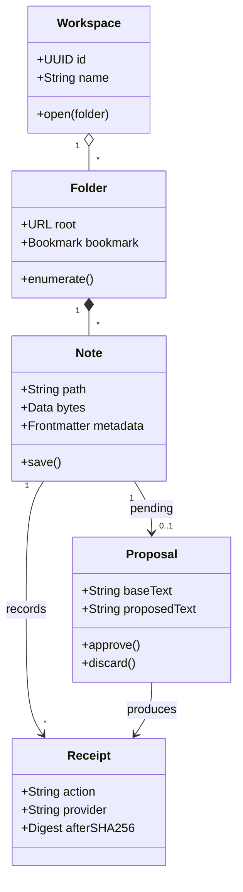
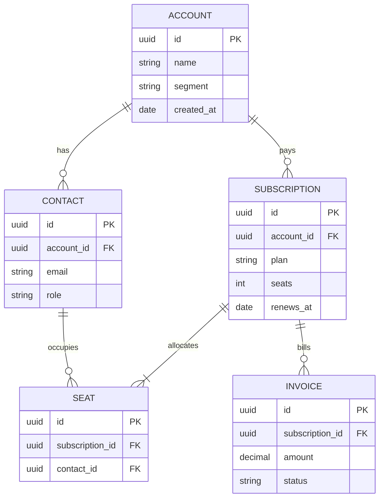
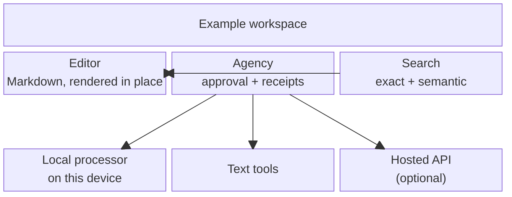
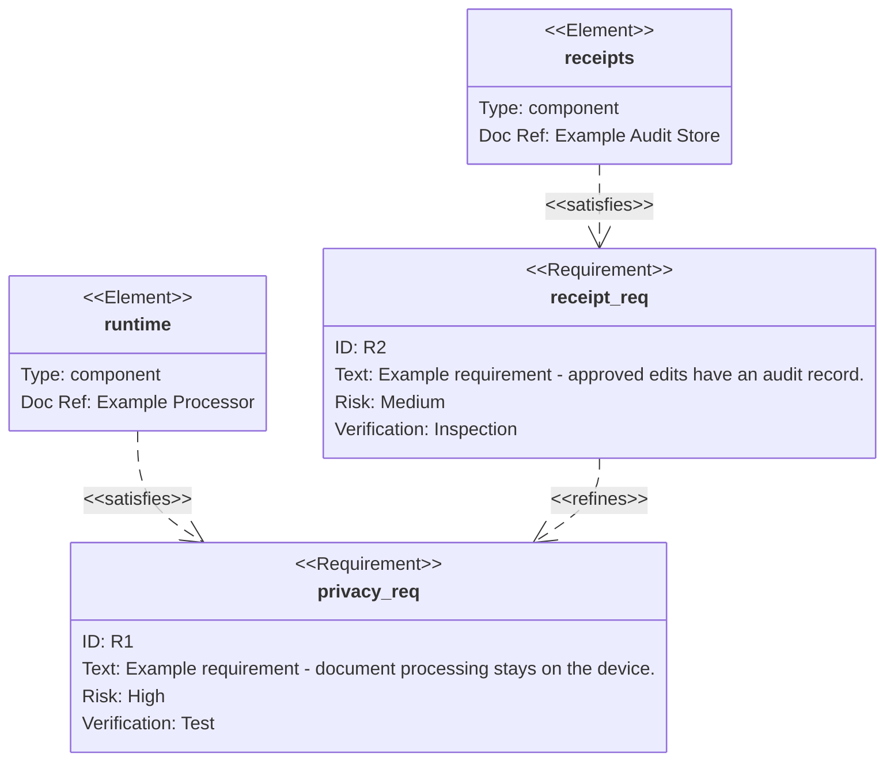
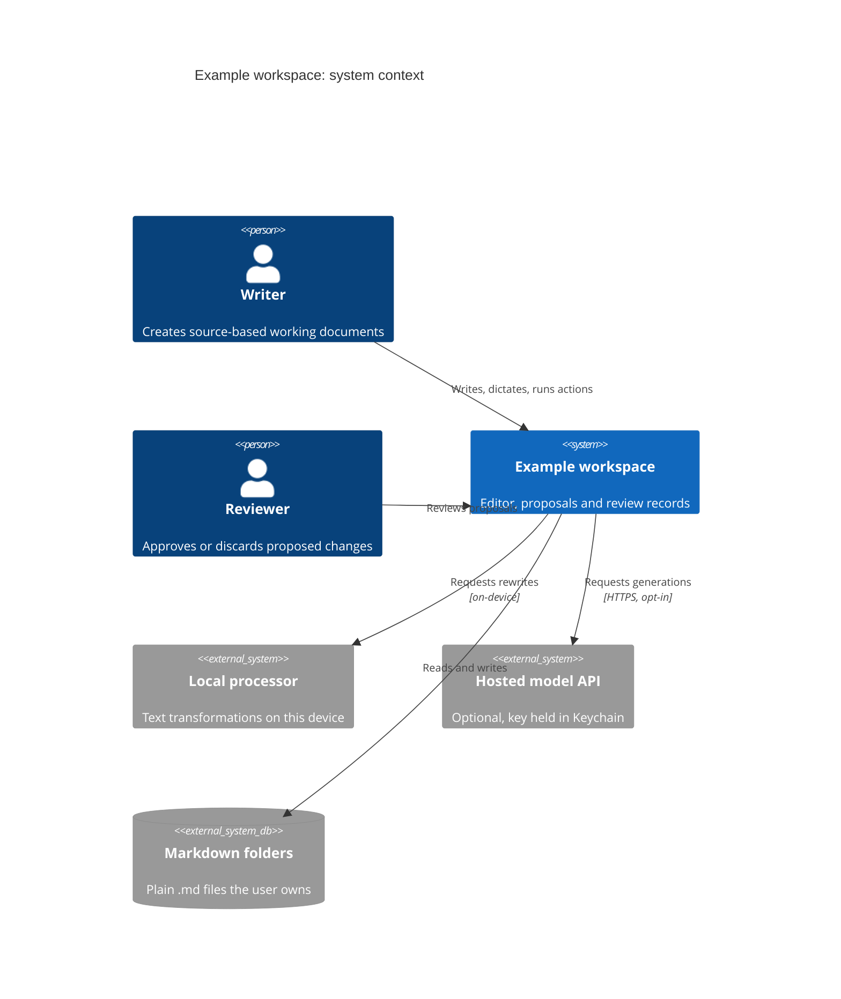
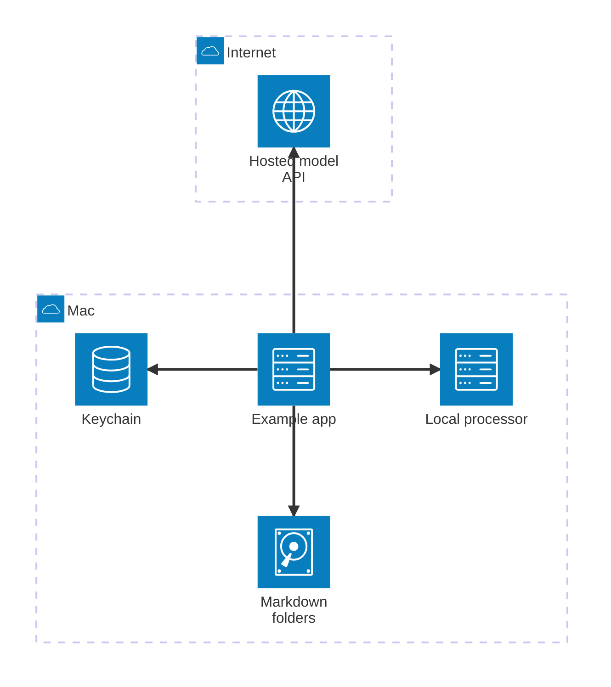
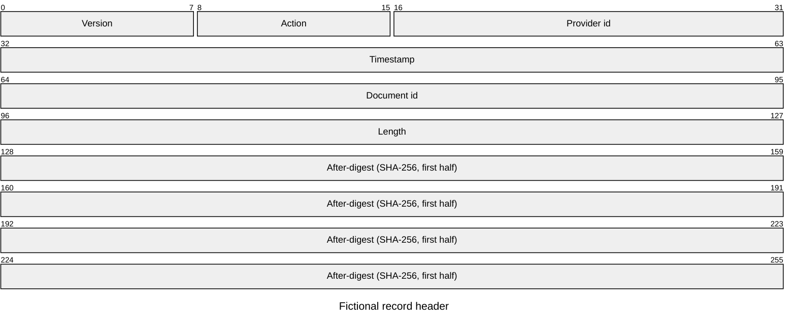

# Diagrams — Structures

[[Charts Gallery]] · Previous: [[Diagrams — Processes]] · Next: [[Diagrams — Connections]]

**Make relationships and boundaries explicit.**

> Every exhibit on this page uses fictional teaching data or an authored scenario. Source labels describe the example; they are not reports, measured Flow benchmarks or product guarantees.

| Form | Use it for |
| --- | --- |
| Class diagram | Describe conceptual entities, their fields and relationships |
| Entity-relationship diagram | Describe records, keys and relationships |
| Block diagram | Arrange a small set of components to explain responsibilities |
| Requirement diagram | Connect an authored requirement to its proposed verification and components |
| C4 context diagram | Show people, a system and its external neighbours |
| Architecture diagram | Describe services, stores and deployment groups |
| Packet diagram | Describe the bit layout of a fictional binary header |

Use the smallest structural view that answers the question: conceptual records, components, system context or a physical record layout.

## The exhibits

### Class diagram

Describe conceptual entities, their fields and relationships. Multiplicity and ownership should have a defined meaning; this is an illustrative model, not Flow source code.

Source: a description of the nouns in a system and how they relate: the data model behind a product, with fields and one-to-many relationships.

[[Charts Gallery]]

### Entity-relationship diagram

Describe records, keys and relationships. Confirm cardinality with the data owner; a diagram is not a database migration.

Source: a list of tables with their keys and how rows reference one another: a database schema, or a CRM's objects.

[[Charts Gallery]]

### Block diagram

Arrange a small set of components to explain responsibilities. Keep arrows labelled or obvious and avoid implying that visual proximity is a connection.

Source: a description of components and how they sit beside and connect to each other: an architecture sketch, a deployment layout.

[[Charts Gallery]]

### Requirement diagram

Connect an authored requirement to its proposed verification and components. A satisfies arrow records an assertion, not completed compliance or test evidence.

Source: a list of requirements with identifiers, risk and verification method, and which components satisfy them: a compliance or safety document. These are fictional requirements and components, not verified Flow guarantees.

[[Charts Gallery]]

### C4 context diagram

Show people, a system and its external neighbours. Keep the level of detail consistent and state the system boundary before drilling into components.

Source: a paragraph naming the system, the people who use it, and the external systems it talks to: the top of an architecture document.

[[Charts Gallery]]

### Architecture diagram

Describe services, stores and deployment groups. The picture records an intended arrangement; it neither provisions infrastructure nor proves a privacy boundary.

Source: a list of services, the stores they use and the edges between them, grouped by where they run: a deployment diagram.

[[Charts Gallery]]

### Packet diagram

Describe the bit layout of a fictional binary header. State field widths and total size; do not use this sample as an actual Flow file-format specification.

Source: a field-by-field layout of a binary record or header, with bit offsets: a protocol note or a file-format spec.

[[Charts Gallery]]

## Use a form with your own records

Copy the whole **Charts Gallery** folder and add that copy to Flow first. Open [[Gallery Data]] to practise with a table you can edit. [[Charts — Living Example]] shows the refresh path. These reference exhibits keep their own embedded examples; they do not change when the practice table changes.

For a new exhibit, open a suitable example in the chart editor or select your own source rows and use Visualize. Keep the units and source explanation with the result. Visualize uses your configured Agency route; inspect its proposal before applying. Authored Mermaid diagrams need deliberate text edits; they are not automatically maintained from the table.

[[Charts Gallery]] · Previous: [[Diagrams — Processes]] · Next: [[Diagrams — Connections]]
