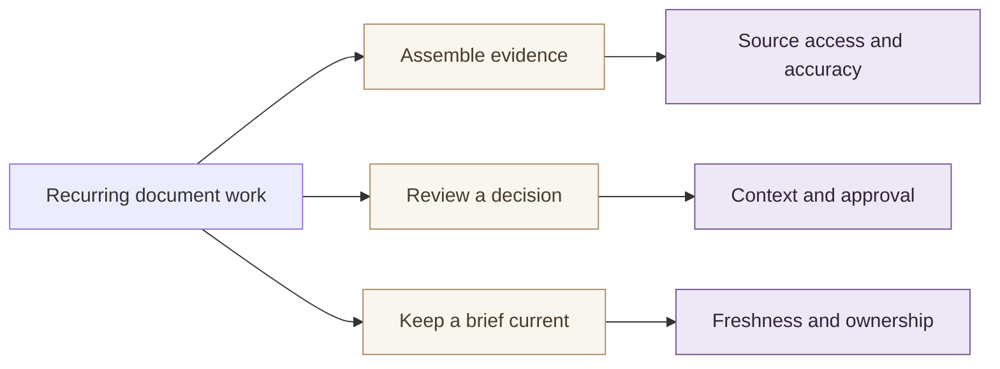

# Market Hypotheses

**A fictional positioning exercise, not a current competitor assessment**

## Segment by the work that fails today

| Hypothesis | Supporting observation | Test that could disprove it |
| --- | --- | --- |
| Reviewers need assumptions with a draft | One fictional handover example | Observe successful handovers without this need |
| Portable files reduce adoption friction | Three coded sample needs | Ask users to complete a real handover |
| Recurring work matters more than one-off drafting | Repeated weekly assembly | Compare repeat use after the first week |

The categories are jobs, not blanket claims about note tools, suites or AI products. A real competitor matrix needs dated, plan-specific evidence. Use [[Research Brief]] to keep the sample findings separate from the market questions.
