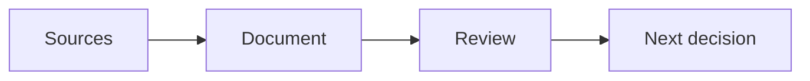

# Using Flow

## Read, work and keep the result

Flow stores your documents as Markdown in folders you choose. Ordinary text, lists, tables, links and images remain readable elsewhere. Flow’s chart, Mermaid and living-data blocks stay in the file too; other readers may show those blocks as source unless they support them.

| Your task | Use in Flow |
| --- | --- |
| Change a business record or simple setting | Table editor on the named input table |
| Compare sources and a draft | Two panes |
| Find a passage | Search, including available related matches |
| Improve or summarise a document | Agency, then inspect the proposed changes |
| Maintain recurring source data | Saved Jobs and a Gather definition |
| Inspect how a calculation works | Edit Definition and its intermediate results |
| Understand a change | Review Changes and History |

## Plain text, with structure

Write *emphasis*, **strong text**, `inline code`, and [web links](https://orionfold.com/flow/). Use headings to give a reader a route through the work.

- [ ] A question still open
- [x] A completed task

> Preserve the source’s wording when quoting, and distinguish it from your interpretation.

A footnote can carry a method or limitation.[^method]

[^method]: This is a formatting example, not a research source.

---

## Tables, charts and diagrams

Use a table’s **Open in the table editor** control to work with its rows and columns. **View ▸ Edit Table** opens the document’s first table. The Guide’s input pages name the table to change; their living reports show the results. A chart fence keeps its data, chart type and encodings as readable text. [[Charts Gallery]] offers linked categories and a working example with two views of the same editable table.



Flow binds charts and tables to local files. A Gather definition can filter, join, calculate and aggregate those rows before the document redraws. A changing chart does not automatically validate the authored conclusion around it.

## Search

Search finds words across every open folder, and the sidebar's **Best** results add **Related matches** beside them. Today Related matches use Apple's on-device sentence model: they never leave this Mac, they match at the scale of a sentence rather than a page, and they are not available in every language. When they are not there, the results say why.

## Jobs and definitions have different jobs

| Editor | Question it answers |
| --- | --- |
| Table | Which business records or input values should change? |
| Jobs | What should this document do, and which source or definition should it use? |
| Definition | How should named inputs become a useful set of rows or values? |

On the main document, choose **File ▸ Night Shift Jobs…** to edit its Jobs. To inspect or edit a calculation, open the linked saved definition first, then choose **File ▸ Edit Definition…**. A definition belongs to the document/folder that carries it; it is not a global schema for all your work.

## Use the right model for the work

Settings ▸ Models shows local and cloud routes. A document action’s reasoning control uses Recommended, On or Off when that route supports the choice. Turning reasoning on can change time and resource use; inspect the output, not just the setting. Model Arena is a separate workspace with published evidence, not a live stream of your Mac’s telemetry.

## Keep the folder portable

Store essential images and sources inside the workspace. Use unique page names for local double-bracket links. To adapt a Guide example, copy the whole folder, add it to Flow, and follow its Make it yours section.

Review the chosen sources and route before using private material. The examples do not send email, publish content or connect to a CRM, medical-record or procurement system.

## What leaves your Mac

Flow is built so that nothing has to leave this Mac, which makes the list of times it reaches the network short enough to print. As of Flow 1.7, this is all of it, and every line is something you started, can switch off, or whose outcome you control:

| When | Where | What is sent | Your switch |
| --- | --- | --- | --- |
| Flow looks for a new version: at launch, then at most once every six hours | orionfold.com | The request for the update list, carrying Flow's version and the updater's name, as any web request does | Flow ▸ Check for Updates… runs it by hand |
| You press Flow Guide Updates… | github.com (the Guide's public home) | A request for the Guide's index, then only the documents you accept | Only when you press it |
| You press Buy Flow Pro or Manage Plan… in Settings ▸ Billing | orionfold.supabase.co (Orionfold's billing service) | The plan and seat count you chose, or your licence file so the server can answer for it | Only when you press it |
| You run a model through Ollama or LM Studio on this Mac | This Mac | Your prompt and the text you selected, when you approve a run | Settings ▸ Models ▸ On this Mac, one switch; a runtime pointed at another machine is refused |
| You add a cloud provider's key | That provider | Your prompt and the text you selected, when you approve a run; the meter shows it first | Settings ▸ Models ▸ Cloud, the key is the switch; remove the key and it is off |
| You refresh a provider's price list, or first set up OpenRouter | openrouter.ai | A request for public prices; nothing about you | Only when you ask |
| You import a model | huggingface.co | The download request for the model you chose | Only when you press it |
| You publish to GitHub Pages | api.github.com (GitHub, under your own account) | The document's pages, pictures, charts and data, to the repository you named, with the token you gave; only what changed since last time | Only when you press it; Forget the token in the Publish task and it is off |
| A document embeds an image by web address | That address | The request for the image, when the document is shown | Write the image into the folder instead, and nothing is fetched |
| You open a web address in a pane | That address | What any browser sends to load a page | Only when you enter one |
| A run looks something up on the web, with web lookups on | The address the model chose | The request for that page, as any web request does, not your document, though the address is chosen from what it says | Settings ▸ Flow System ▸ Web Lookups, off until you turn it on |

That is the whole list. As of Flow 1.7, Flow keeps no usage statistics, sends no crash reports, carries no analytics or advertising code, has no install identifier, and never checks a licence online to keep working. If a future Flow offers to share counts or crash reports with Orionfold, it will be a switch that starts off, and this table will list it beside the others.

Need to tell us about a problem? Help ▸ Copy Diagnostics… puts a short block on the clipboard: the Flow and macOS versions, the kind of Mac, which domains are on, and the last crash's summary if there is one, with no paths, titles, or names in it. You see the exact text before it is copied, and it goes nowhere until you paste it.

## Document properties travel with the file

```yaml
title: My working brief
tags: [review, weekly]
```

Frontmatter keeps document properties such as the title and tags, plus Flow’s saved Jobs and Definition configuration. Those declarations travel with the Markdown file. Business rows and simple business settings live in the input tables, so everyday changes do not require YAML editing. Use the existing title, tag, Jobs and Definition controls for the properties they support; Source remains available for advanced declarations. Flow does not yet have a general form for every custom property.

Keep the named heading and column names when replacing sample rows. Use Definition editing if you want to change what is read or calculated. Follow [[Night Shift Handbook]] for the complete refresh cycle.
