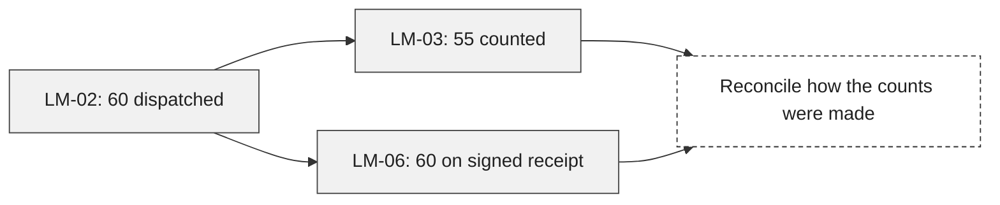

# Legal Matter

**The file contains two different arrival counts. Preserve both until they are reconciled.** Harbor Supply invoiced sixty cartons; Elm Studio's receiving note records fifty-five. A receipt added later records sixty. This page gives a reviewer the facts, the order in which events occurred, and the questions the documents do not settle.

> Fictional commercial matter. This is factual preparation for professional review, not a legal conclusion or a communication ready to send.

<!-- data: data/legal-matter-*.json#review -->
| Matter | As of |
| --- | --- |
| Harbor Supply / Elm Studio | 2026-09-12 |

## Read the chronology, then the records

The date is the event date. An exhibit received later can belong earlier in the chronology. Source IDs open through [[Legal Matter Sources]].

<!-- data: data/legal-matter-*.json#chronology -->
| Date | Event | Basis | Exhibit |
| --- | --- | --- | --- |
| 2026-08-10 | Purchase order lists 60 cartons | Order record | LM-01 |
| 2026-08-27 | Dispatch sheet lists 60 cartons loaded | Dispatch record | LM-02 |
| 2026-08-28 | Receiving note records 55 cartons counted | Receiving record | LM-03 |
| 2026-08-28 | Signed receipt lists 60 cartons delivered | Receipt added 12 September | LM-06 |
| 2026-08-29 | Invoice bills 60 cartons at USD 120 each | Invoice record | LM-04 |
| 2026-09-02 | Buyer asks for a five-carton reconciliation | Correspondence | LM-05 |

## The evidence does not yet answer the central question

This is an authored assessment of the **12 September sample packet**. Keep it separate from the automatically sorted chronology.

| Question | What supports it | What remains unresolved | Next document or conversation |
| --- | --- | --- | --- |
| What was ordered? | LM-01 lists 60 cartons. | No amended order is supplied. | Confirm the order file is complete. |
| What was loaded? | LM-02 lists 60 cartons. | A departure count is not an arrival count. | Ask for carrier handling records. |
| What arrived? | LM-03 records 55; LM-06 records 60. | The two arrival records disagree. | Reconcile the count with the receiver and carrier. |
| What was invoiced? | LM-04 lists 60 × USD 120 = USD 7,200. | The invoice does not resolve physical delivery. | Hold conclusions until the records are reconciled. |

### Two records of arrival, one unresolved difference

This authored diagram describes the 12 September sample packet; it does not update from the input tables.

### A useful handover paragraph

The packet contains an order, dispatch sheet, receiving note, invoice, correspondence, and a later-supplied signed receipt. The only clear agreement across the commercial records is the ordered and invoiced quantity. The receiving discrepancy remains open. A reviewer should ask how each count was made and whether any cartons were recorded separately.

## Packet completeness

<!-- data: data/legal-matter-*.json#counts -->
| Metric | Value |
| --- | --- |
| Events in the packet | 6 |
| Source records supplied | 6 |

Counts measure the supplied packet, not its adequacy. The source index identifies the six records individually.

## Make it yours

1. Duplicate the whole **Legal Matter** folder into a workspace of your own and add the copy to Flow.
2. Read [[Legal Matter Settings]] and the two snapshots in `inputs/`. Inspect the added LM-06 event and its earlier date before making any edits.
3. Open [[legal-snapshot-2026-09-12]] and use the **Events** table's **Open in the table editor** control. Change LM-06's event date from **2026-08-28 to 2026-08-30**, then save. Use **Run now** from the moon. Expect the receipt row to move **after the invoice and before the September correspondence**, with the event count still six. Revert the experiment before using the fictional source text again.
4. Replace the sample exhibits and transcribed event rows with records you are authorized to use. Maintain the source index and review the authored matrix yourself. Copy the complete folder so every exhibit travels with the chronology.
5. Open [[Legal Matter Refresh]], then choose **File ▸ Edit Definition…**. Return here and use **File ▸ Night Shift Jobs…** to change which local inputs are watched. Enable Night Shift only if you want scheduled runs.

## Optional overnight notes

The saved jobs collect local data and watch source changes. They do not need a model. To add a short interpretation, use **File ▸ Night Shift Jobs…** on this document and add **Overnight notes** after configuring a local Night model. Read the proposed notes against the inputs; an interpretation is not another source. Nothing is sent or published by this workspace.

<!-- night: notes -->
<!-- /night: notes -->
