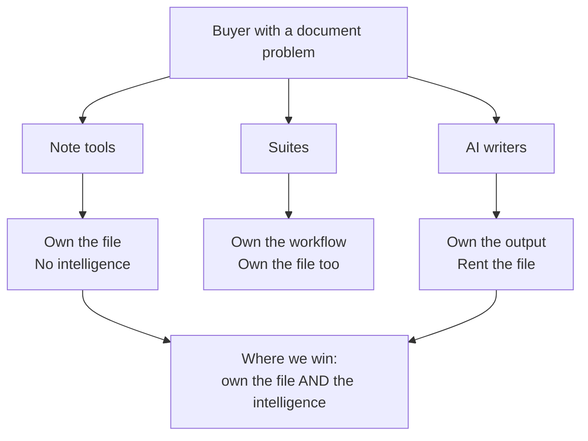

# Where we sit

Three kinds of product compete for the same budget, and they are not really
competing with each other. Knowing which one a prospect is comparing us to
predicts the deal better than company size does.




*The map above started here.*

## The three, side by side

| | Note tools | Suites | AI writers |
| --- | --- | --- | --- |
| Files are yours | yes | no | no |
| Works offline | yes | partly | no |
| Intelligence built in | no | bolted on | yes |
| Output quality bar | plain | corporate | generic |
| Switching cost | low | very high | low |
| Who buys | individuals | IT | individuals |

The row that matters is the last one. Suites are sold to IT and take nine
months. The other two are sold to the person with the problem, which is the
motion [[Quarterly Business Review]] found working.

## Why self-serve stalled

Two of the AI writers cut their entry price in June, to roughly a third of
ours. Our self-serve conversion halved in the same window. We do not have
attribution good enough to call that causal, and [[Customer Interviews]] found
no self-serve user who mentioned price unprompted — but eleven interviews
cannot see a person who bounced off a pricing page.

```chart
chartType: Slope Chart
title: Entry price moved under us
subtitle: Monthly list price, individual tier
source: Public pricing pages, sampled 2 October 2026
data:
  - {vendor: Us, period: May, price: 20}
  - {vendor: Us, period: October, price: 20}
  - {vendor: Writer A, period: May, price: 18}
  - {vendor: Writer A, period: October, price: 7}
  - {vendor: Writer B, period: May, price: 22}
  - {vendor: Writer B, period: October, price: 8}
semantic_types: {vendor: Category, period: Category, price: Quantity}
encodings:
  x: {field: period}
  y: {field: price}
  color: {field: vendor}
```

## The position we are defending

Own the file *and* the intelligence. Note tools give you the first and leave you
to think alone; AI writers give you the second and keep your work in their
database. Nobody is credibly doing both, and the switching cost of doing both
badly is what keeps suite customers where they are.

That is the argument. Whether it survives another quarter of price pressure is
the open question in [[How We Decided]].
