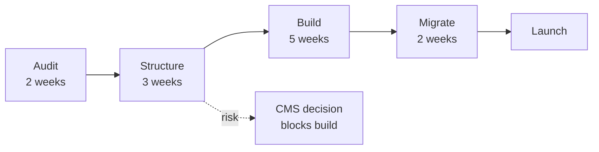

# Website Relaunch — Project Plan

**Owner:** Priya Raman · **Sponsor:** Marketing · **Target:** 14 November 2026
**Status:** on track, one dependency at risk

The current site was built for a company that sold one product to one buyer. We
now sell three, to two buyers, and the navigation has been patched around that
four times. This is a rebuild of the structure, not a redesign of the pixels.


*Every plan starts as handwriting.*

## What done looks like

| Outcome | Measure | Today | Target |
| --- | ---: | ---: | ---: |
| A visitor can find the right product in one hop | clicks to product page | 3.4 | **≤ 2** |
| Pages load fast enough not to lose people | p75 load | 4.1s | **< 1.5s** |
| Marketing can publish without engineering | eng tickets per launch | 6 | **0** |
| Search traffic is not lost in the move | organic sessions, 30d after | — | **≥ 98% of before** |

The last row is the one that kills relaunches. It is a constraint, not a goal.

## Phases



## Schedule

```chart
chartType: Gantt Chart
title: Eleven weeks, with migration overlapping build
subtitle: Website relaunch, Sept–Nov 2026
data:
  - {phase: Audit, start: 2026-09-01, end: 2026-09-15}
  - {phase: Structure, start: 2026-09-15, end: 2026-10-06}
  - {phase: Build, start: 2026-10-06, end: 2026-11-10}
  - {phase: Migrate, start: 2026-10-27, end: 2026-11-14}
semantic_types: {phase: Category, start: Time, end: Time}
encodings:
  y: {field: phase}
  x: {field: start}
  x2: {field: end}
```

## Workstreams and owners

| Workstream | Owner | Depends on | Status |
| --- | --- | --- | --- |
| Content audit | Priya | — | done |
| Information architecture | Priya + Dan | audit | in progress |
| CMS selection | Dan | — | **at risk** |
| Design system | Mei | IA | not started |
| Build | Mei + contractor | CMS, design | not started |
| URL mapping and redirects | Dan | IA | not started |
| Analytics parity | Sam | build | not started |

## The risk worth naming

**CMS selection blocks the build and has slipped twice.** Two candidates remain;
the decision needs a call on whether marketing edits templates or only content.
If it slips past 6 October, the build compresses and migration overlaps launch
— which is how redirects get rushed and organic traffic gets lost.

**Mitigation:** decide by 3 October using the criteria already agreed, or take
the default (the simpler CMS, less template freedom) and move on. A default is
better than a slip here.

## Open questions

- [ ] Do we migrate the blog archive, or leave it on the old domain?
- [ ] Who owns redirects after launch — marketing or engineering?
- [x] Do we keep the pricing page structure? *Yes, decided 22 September.*

## Related

[[Content Strategy — Q4]] depends on this shipping — half the planned pieces
need the new template. [[Meeting Notes — Weekly Staff]] carries the running
status.
