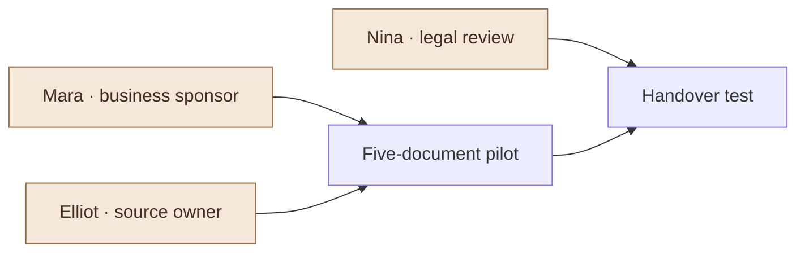

# Account Brief

**Meridian Retail · fictional advisory opportunity · next meeting preparation**

## Resolve the handover questions before sending a final proposal

The need is clear: recurring trading summaries and vendor briefs take repeated assembly work. The fit is still conditional. Counsel’s export needs and the Windows review path remain open.

## Questions for the meeting

<!-- data: data/review-*.json#questions -->
| Id | Requirement | Owner | Evidence |
| --- | --- | --- | --- |
| R3 | Export for counsel | Nina | Discovery 02 |
| R4 | Windows reviewers | Mara | Discovery 02 |

## What is ready

[[Meridian Proposal]] is a scoped draft with fees, deliverables and exclusions. [[Account Discovery]] preserves the context. [[Sales Performance]] is a separate fictional prior-quarter example; it is not revenue from this account.

Before the meeting, use Search to find a requirement and compare the proposal beside it. Agency can draft an agenda or suggest clearer wording; review the text and assumptions before applying.
## Make it yours

1. Copy this entire folder in Finder, give the copy a name, then choose **Add Folder** in Flow. Keep its local subfolders beside the documents.
2. Open **Account Requirements** and choose **View ▸ Edit Table** to replace the fictional records. Keep the column names and edit the cells, then save. The saved definition controls the calculation; the living report’s Jobs control recurring work.
3. After you have evidence for the export requirement, change R3 from Open to Confirmed. Gather should leave only the Windows requirement in the questions table.
4. With this document open, choose **File ▸ Night Shift Jobs…** to review its saved work; save any changes and close the editor. Choose **Settings ▸ Night Shift ▸ Run now**, then inspect the changed table or chart and the Briefing. Gather uses local calculations; optional Overnight notes need a configured local model. Enable Night Shift only for scheduled runs.
5. Replace the illustrative prose with your own assessment after checking the inputs. A chart can refresh its numbers; it cannot certify the conclusions around it.

## Review notes

Keep your decision here. Optional Night Shift notes appear below after a configured local model runs.

<!-- night: notes -->
<!-- /night: notes -->
