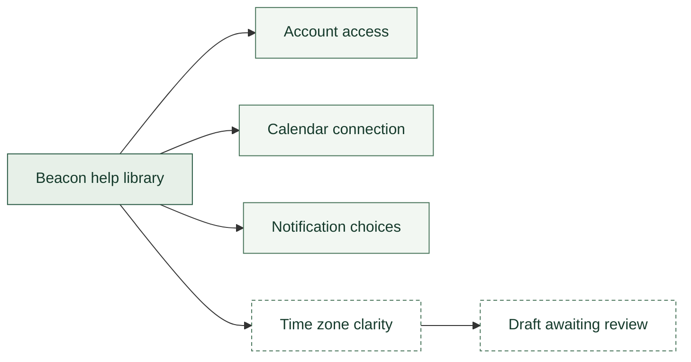

# Support Knowledge

**Turn the next repeated question into a better answer.** Leila's desk connects resolved cases to a small help library for the fictional Beacon Scheduling product. Counts help her notice repetition; the source cases and article text help her decide what to change.

<!-- data: data/support-knowledge-*.json#review -->
| Product | As of | Scope |
| --- | --- | --- |
| Beacon Scheduling | 2026-09-12 | Fictional resolved-case sample |

## The current review candidate

This queue includes topics that meet the owner-selected count threshold and lack a Current article. In the supplied packet at the original two-case threshold, the second time-zone question brings a held draft into review.

<!-- data: data/support-knowledge-*.json#reviewCandidates -->
| Topic | Tickets | Article | Status |
| --- | --- | --- | --- |
| Time zones | 2 | Support Proposal — Time Zone Clarity | Draft |

Open [[Support Proposal — Time Zone Clarity]] to read the ambiguous sentence, proposed replacement, source cases, and review checklist. The proposal is authored sample content; the Gather job only maintains this queue.

## Where the sample questions cluster

Counts cover resolved cases in the latest packet. They are not issue rates or customer prevalence; no customer-population denominator is supplied.

```chart data: data/support-knowledge-*.json#byTopic
chartType: Lollipop Chart
title: "Resolved sample cases by primary topic"
subtitle: "One topic per case · twelve fictional cases in the supplied packet"
source: "Newest local support snapshot; resolved cases only"
data:
  - {topic: "Access", tickets: 4}
  - {topic: "Calendar sync", tickets: 3}
  - {topic: "Notifications", tickets: 3}
  - {topic: "Time zones", tickets: 2}
semantic_types: {"topic": "Category", "tickets": "Count"}
encodings:
  y: {"field": "topic"}
  x: {"field": "tickets"}
  color: {"field": "topic", "scheme": "greens"}
```

## A small library with a visible gap

The topic map is an authored navigation aid. It does not generate or maintain itself.



<!-- data: data/support-knowledge-*.json#coverage -->
| Topic | Tickets | Article | Status |
| --- | --- | --- | --- |
| Access | 4 | Support Article — Account Access | Current |
| Calendar sync | 3 | Support Article — Calendar Connection | Current |
| Notifications | 3 | Support Article — Notification Choices | Current |
| Time zones | 2 | Support Proposal — Time Zone Clarity | Draft |

[[Support Knowledge Sources]] links each topic to its cases and each article to its local document. Current is an owner-maintained state in the fictional sample; it is not evidence of a publication action by Flow.

## Work the queue, not just the chart

Read a repeated case. Check whether the existing article answers it clearly. If it does not, make a small proposal with an example and source links. Review the procedure in the product before approving it. Keep publication separate from this workspace's refresh.

## Make it yours

1. Copy the whole **Support Knowledge** folder into your own workspace and add that copy to Flow. The help articles travel with it.
2. In [[Support Knowledge Settings]], open the **Settings** table with **Open in the table editor**, change `review_threshold` from **2 to 3**, save, and use **Run now** from the moon.
3. Expect the **review-candidate table to become empty**: Time zones has only two cases. The topic chart stays **4 / 3 / 3 / 2**, and its article stays Draft. A queue preference does not change the underlying evidence or approve an article.
4. Replace the fictional digests, snapshots, and help articles with material you are authorized to use. Keep one primary topic per case and maintain the article index. Later dated snapshots should contain the complete selected sample.
5. Open [[Support Knowledge Refresh]], then choose **File ▸ Edit Definition…**. Return here and use **File ▸ Night Shift Jobs…** to adjust watches; enable Night Shift for scheduled runs if useful.

## Optional overnight notes

The saved jobs collect local data and watch source changes. They do not need a model. To add a short interpretation, use **File ▸ Night Shift Jobs…** on this document and add **Overnight notes** after configuring a local Night model. Read the proposed notes against the inputs; an interpretation is not another source. Nothing is sent or published by this workspace.

<!-- night: notes -->
<!-- /night: notes -->
