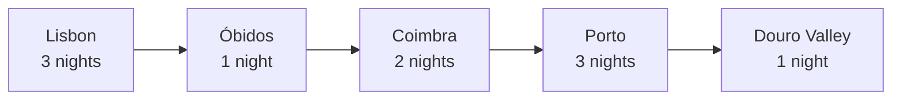

# Portugal — 8 to 18 October

Two of us, ten days, driving. The plan is deliberately loose after Porto: the
first half is booked, the second half is a shortlist.


*Swap in your own photos as you go — this is your document.*

## The shape of it



## Booked

| Dates | Where | Stay | Cost |
| --- | --- | --- | ---: |
| 8–11 Oct | Lisbon | Alfama apartment | €420 |
| 11–12 Oct | Óbidos | Pousada | €160 |
| 12–14 Oct | Coimbra | Hotel Oslo | €190 |
| 14–17 Oct | Porto | Cedofeita apartment | €480 |
| 17–18 Oct | Douro | Quinta guesthouse | €210 |
| | | **Accommodation** | **€1,460** |

Flights €640 return. Car €280 for eight days, picked up at Lisbon airport on the
11th, not the 8th — Lisbon is worse with a car than without one.

## Budget

```chart
chartType: Donut Chart
title: Where the money goes
subtitle: Estimated total, euros
data:
  - {category: Accommodation, amount: 1460}
  - {category: Flights, amount: 640}
  - {category: Food, amount: 700}
  - {category: Car and fuel, amount: 400}
  - {category: Everything else, amount: 300}
semantic_types: {category: Category, amount: Quantity}
encodings:
  size: {field: amount}
  color: {field: category}
```

About €3,500 all in, which is €350 a day for two. Tight but not uncomfortable.

## Lisbon — 3 nights

- [x] Book the Alfama place
- [ ] Time out Market — go early, it is unbearable by one
- [ ] Gulbenkian museum — the founder's collection, not the modern wing
- [ ] Day trip to Sintra — **book Pena Palace ahead**, it sells out
- [ ] Tram 28 at 7am or not at all

## Coimbra — 2 nights

The university library needs a timed ticket and they are limited. Book the
moment the date is fixed.

## Porto — 3 nights

- [ ] Livraria Lello (ticket, redeemable against a book)
- [ ] Serralves — gardens more than the museum
- [ ] Cross the bridge on foot at dusk
- [ ] One port lodge, not four

## Douro — the loose day

Options, decide there:

| Option | Why | Cost |
| --- | --- | ---: |
| Quinta tour and tasting | The obvious one, worth it once | €60 |
| River cruise, Pinhão | Better views than the road | €35 |
| Just drive the N222 | Free, and reportedly the best road in Portugal | €0 |

## Things learned last time

- Lunch is 1pm and dinner is 8pm; arriving at 6pm gets you a closed kitchen
- The tolls need a transponder — get one with the car
- October is beautiful and half-empty, but the Atlantic side is genuinely cold
