# Visualization Gallery

Every chart and diagram Flow draws in place, offline, from plain Markdown. Each entry says what source material gets you there: select that shape of text and run **Visualize** (⇧⌘V), or write the fence by hand. A ` ```chart ` body is readable YAML; a ` ```mermaid ` body renders on GitHub the same way.

## Comparison and ranking

### Bar chart

Source: a two-column table, one category column and one number column, with up to a dozen rows. Name one row in `highlight` and it takes the accent while the rest recede.

```chart
chartType: Bar Chart
title: Enterprise drove the year's biggest quarter
subtitle: New ARR by quarter, $k
source: Finance close, FY26
highlight: Q3 FY26
data:
  - {quarter: Q4 FY25, arr: 410}
  - {quarter: Q1 FY26, arr: 455}
  - {quarter: Q2 FY26, arr: 498}
  - {quarter: Q3 FY26, arr: 687}
  - {quarter: Q4 FY26, arr: 602}
semantic_types: {quarter: Category, arr: Amount}
encodings:
  x: {field: quarter}
  y: {field: arr}
```

### Grouped bar chart

Source: a table with a category column, a group column and a value column: the same categories measured under two or three conditions, such as regions across years.

```chart
chartType: Grouped Bar Chart
title: EMEA closed the gap with North America in FY26
subtitle: Bookings by region and fiscal year, $M
source: Sales operations
data:
  - {region: North America, year: FY24, bookings: 18.2}
  - {region: North America, year: FY25, bookings: 21.0}
  - {region: North America, year: FY26, bookings: 23.4}
  - {region: EMEA, year: FY24, bookings: 9.1}
  - {region: EMEA, year: FY25, bookings: 14.6}
  - {region: EMEA, year: FY26, bookings: 21.9}
  - {region: APAC, year: FY24, bookings: 4.3}
  - {region: APAC, year: FY25, bookings: 6.8}
  - {region: APAC, year: FY26, bookings: 9.7}
semantic_types: {region: Region, year: Category, bookings: Amount}
encodings:
  x: {field: region}
  y: {field: bookings}
  group: {field: year}
```

### Stacked bar chart

Source: a table with a category column, a part column and a value column, where the parts of each category add up to a meaningful whole: cost by team and category, headcount by office and function.

```chart
chartType: Stacked Bar Chart
title: Cloud is now more than half of every team's spend
subtitle: Monthly run-rate by team and cost category, $k
source: FinOps, July 2026
data:
  - {team: Platform, category: Cloud, cost: 142}
  - {team: Platform, category: Tooling, cost: 38}
  - {team: Platform, category: Vendors, cost: 21}
  - {team: Data, category: Cloud, cost: 118}
  - {team: Data, category: Tooling, cost: 27}
  - {team: Data, category: Vendors, cost: 44}
  - {team: Product, category: Cloud, cost: 36}
  - {team: Product, category: Tooling, cost: 31}
  - {team: Product, category: Vendors, cost: 19}
  - {team: Research, category: Cloud, cost: 97}
  - {team: Research, category: Tooling, cost: 12}
  - {team: Research, category: Vendors, cost: 8}
semantic_types: {team: Category, category: Category, cost: Amount}
encodings:
  x: {field: team}
  y: {field: cost}
  color: {field: category}
```

### Lollipop chart

Source: the same two-column table as a bar chart, but with many rows or long labels: the thin stem keeps a ranked list of twenty items legible.

```chart
chartType: Lollipop Chart
title: Onboarding and search are the two most requested improvements
subtitle: Feature requests logged in Q3, count
source: Support desk export
highlight: Guided onboarding
data:
  - {request: Guided onboarding, count: 214}
  - {request: Faster search, count: 187}
  - {request: Offline mode, count: 142}
  - {request: Shared folders, count: 121}
  - {request: Dark mode for print, count: 96}
  - {request: Keyboard shortcuts, count: 88}
  - {request: Export to PDF, count: 74}
  - {request: Calendar sync, count: 51}
  - {request: Audio notes, count: 43}
  - {request: Custom themes, count: 29}
semantic_types: {request: Category, count: Count}
encodings:
  x: {field: request}
  y: {field: count}
```

### Bar table

Source: a ranked table of names and one number, when you want the numbers read as a list as well as compared: a leaderboard, a vendor shortlist, a benchmark.

```chart
chartType: Bar Table
title: Local models close in on the hosted frontier at a fraction of the cost
subtitle: Proofread quality score on the 40-document benchmark, 0–100
source: Runtime evaluation, August 2026
data:
  - {model: Hosted frontier, score: 91}
  - {model: qwen3.5-35b-a3b-4bit, score: 87}
  - {model: gemma-4-27b-4bit, score: 84}
  - {model: qwen3.5-9b-4bit, score: 79}
  - {model: llama-4-scout-8b, score: 73}
  - {model: phi-5-mini, score: 66}
semantic_types: {model: Name, score: Score}
encodings:
  y: {field: model}
  x: {field: score}
```

### Pyramid chart

Source: a table with an age band or tier column, a two-value side column and a count: a population pyramid, or any two cohorts mirrored around a centre.

```chart
chartType: Pyramid Chart
title: The customer base skews younger than the buyer base
subtitle: Active users and paying admins by age band, thousands
source: Product analytics, July 2026
data:
  - {band: 18–24, side: Users, people: 48}
  - {band: 18–24, side: Admins, people: 4}
  - {band: 25–34, side: Users, people: 112}
  - {band: 25–34, side: Admins, people: 21}
  - {band: 35–44, side: Users, people: 96}
  - {band: 35–44, side: Admins, people: 38}
  - {band: 45–54, side: Users, people: 61}
  - {band: 45–54, side: Admins, people: 29}
  - {band: 55–64, side: Users, people: 27}
  - {band: 55–64, side: Admins, people: 12}
  - {band: 65+, side: Users, people: 9}
  - {band: 65+, side: Admins, people: 3}
semantic_types: {band: Category, side: Category, people: Count}
encodings:
  y: {field: band}
  x: {field: people}
  color: {field: side}
```

### Bullet chart

Source: a table of metrics, each with an actual value and a target: the quarterly scorecard, where every row is a measure against its goal.

```chart
chartType: Bullet Chart
title: Three of four Q3 targets met; expansion fell short
subtitle: Actual against plan, Q3 FY26
source: Board scorecard
data:
  - {metric: New ARR ($k), actual: 687, goal: 650}
  - {metric: Net retention (%), actual: 112, goal: 115}
  - {metric: Gross margin (%), actual: 81, goal: 78}
  - {metric: Support CSAT (%), actual: 94, goal: 92}
semantic_types: {metric: Category, actual: Quantity, goal: Quantity}
encodings:
  y: {field: metric}
  x: {field: actual}
  goal: {field: goal}
```

### KPI card

Source: a single line or a one-row table naming a metric, its current value and its target: the one number the page is about.

```chart
chartType: KPI Card
title: Net revenue retention
subtitle: Trailing twelve months, against the 115% plan
source: Finance, July 2026
data:
  - {metric: Net revenue retention, value: 112, goal: 115}
semantic_types: {metric: Name, value: Percentage, goal: Percentage}
encodings:
  metric: {field: metric}
  value: {field: value}
  goal: {field: goal}
```

## Change over time

### Line chart

Source: a table with a date column and one or more numeric series columns, or a long table of date, series, value: weekly actives, monthly revenue, daily latency.

```chart
chartType: Line Chart
title: Weekly actives doubled after the March launch
subtitle: Weekly active documents by plan, thousands
source: Product analytics
highlight: Team
data:
  - {week: 2026-01-05, plan: Free, actives: 14.2}
  - {week: 2026-01-05, plan: Pro, actives: 6.1}
  - {week: 2026-01-05, plan: Team, actives: 3.8}
  - {week: 2026-02-02, plan: Free, actives: 15.0}
  - {week: 2026-02-02, plan: Pro, actives: 6.6}
  - {week: 2026-02-02, plan: Team, actives: 4.4}
  - {week: 2026-03-02, plan: Free, actives: 18.9}
  - {week: 2026-03-02, plan: Pro, actives: 8.2}
  - {week: 2026-03-02, plan: Team, actives: 6.9}
  - {week: 2026-04-06, plan: Free, actives: 24.6}
  - {week: 2026-04-06, plan: Pro, actives: 10.4}
  - {week: 2026-04-06, plan: Team, actives: 9.8}
  - {week: 2026-05-04, plan: Free, actives: 27.1}
  - {week: 2026-05-04, plan: Pro, actives: 11.9}
  - {week: 2026-05-04, plan: Team, actives: 12.7}
  - {week: 2026-06-01, plan: Free, actives: 28.3}
  - {week: 2026-06-01, plan: Pro, actives: 13.2}
  - {week: 2026-06-01, plan: Team, actives: 15.1}
  - {week: 2026-07-06, plan: Free, actives: 29.0}
  - {week: 2026-07-06, plan: Pro, actives: 14.6}
  - {week: 2026-07-06, plan: Team, actives: 17.9}
semantic_types: {week: Date, plan: Category, actives: Count}
encodings:
  x: {field: week}
  y: {field: actives}
  color: {field: plan}
```

### Area chart

Source: a date column and one cumulative or volume measure, such as total storage, cumulative signups or cash balance, where the filled area reads as the amount.

```chart
chartType: Area Chart
title: Cash runway held above 24 months through the year
subtitle: Month-end cash balance, $M
source: Treasury
data:
  - {month: 2025-08, cash: 42.1}
  - {month: 2025-09, cash: 41.0}
  - {month: 2025-10, cash: 39.8}
  - {month: 2025-11, cash: 38.9}
  - {month: 2025-12, cash: 37.5}
  - {month: 2026-01, cash: 36.6}
  - {month: 2026-02, cash: 35.9}
  - {month: 2026-03, cash: 34.8}
  - {month: 2026-04, cash: 34.4}
  - {month: 2026-05, cash: 33.7}
  - {month: 2026-06, cash: 33.0}
  - {month: 2026-07, cash: 32.6}
semantic_types: {month: YearMonth, cash: Amount}
encodings:
  x: {field: month}
  y: {field: cash}
```

### Streamgraph

Source: a long table of date, category and value with several categories per date, such as share of attention, traffic by channel or tickets by product, when the story is how the mix shifts.

```chart
chartType: Streamgraph
title: Organic search overtook paid by spring
subtitle: Monthly site visits by channel, thousands
source: Web analytics
data:
  - {month: 2026-01, channel: Paid, visits: 62}
  - {month: 2026-01, channel: Organic, visits: 41}
  - {month: 2026-01, channel: Referral, visits: 18}
  - {month: 2026-01, channel: Direct, visits: 24}
  - {month: 2026-02, channel: Paid, visits: 58}
  - {month: 2026-02, channel: Organic, visits: 47}
  - {month: 2026-02, channel: Referral, visits: 21}
  - {month: 2026-02, channel: Direct, visits: 26}
  - {month: 2026-03, channel: Paid, visits: 51}
  - {month: 2026-03, channel: Organic, visits: 56}
  - {month: 2026-03, channel: Referral, visits: 25}
  - {month: 2026-03, channel: Direct, visits: 29}
  - {month: 2026-04, channel: Paid, visits: 44}
  - {month: 2026-04, channel: Organic, visits: 68}
  - {month: 2026-04, channel: Referral, visits: 31}
  - {month: 2026-04, channel: Direct, visits: 33}
  - {month: 2026-05, channel: Paid, visits: 40}
  - {month: 2026-05, channel: Organic, visits: 79}
  - {month: 2026-05, channel: Referral, visits: 36}
  - {month: 2026-05, channel: Direct, visits: 35}
  - {month: 2026-06, channel: Paid, visits: 38}
  - {month: 2026-06, channel: Organic, visits: 88}
  - {month: 2026-06, channel: Referral, visits: 39}
  - {month: 2026-06, channel: Direct, visits: 38}
semantic_types: {month: YearMonth, channel: Category, visits: Count}
encodings:
  x: {field: month}
  y: {field: visits}
  color: {field: channel}
```

### Range area chart

Source: a date column with a low and a high column, and optionally a central value: a forecast with its confidence band, a temperature range, a p10/p90 spread.

```chart
chartType: Range Area Chart
title: The Q4 forecast band narrowed as the pipeline matured
subtitle: Forecast new ARR with 80% band, $k
source: Revenue operations
data:
  - {month: 2026-08, low: 520, high: 780}
  - {month: 2026-09, low: 548, high: 760}
  - {month: 2026-10, low: 571, high: 742}
  - {month: 2026-11, low: 596, high: 724}
  - {month: 2026-12, low: 612, high: 706}
  - {month: 2027-01, low: 629, high: 691}
semantic_types: {month: YearMonth, low: Amount, high: Amount}
encodings:
  x: {field: month}
  y: {field: low}
  y2: {field: high}
```

### Sparkline

Source: a short date-and-value table meant to sit beside a sentence, such as a week of latency or a month of signups, shown without axes as a glance.

```chart
chartType: Sparkline
title: p95 latency, last 14 days
source: Observability
data:
  - {day: 2026-08-06, ms: 412}
  - {day: 2026-08-07, ms: 398}
  - {day: 2026-08-08, ms: 405}
  - {day: 2026-08-09, ms: 371}
  - {day: 2026-08-10, ms: 366}
  - {day: 2026-08-11, ms: 512}
  - {day: 2026-08-12, ms: 488}
  - {day: 2026-08-13, ms: 344}
  - {day: 2026-08-14, ms: 339}
  - {day: 2026-08-15, ms: 341}
  - {day: 2026-08-16, ms: 328}
  - {day: 2026-08-17, ms: 330}
  - {day: 2026-08-18, ms: 317}
  - {day: 2026-08-19, ms: 312}
semantic_types: {day: Date, ms: Duration}
encodings:
  x: {field: day}
  y: {field: ms}
```

### Slope chart

Source: a table with exactly two time points per item, such as before and after or this year and last, where the steepness of each line is the finding.

```chart
chartType: Slope Chart
title: Every region grew; APAC more than doubled
subtitle: Bookings FY25 → FY26, $M
source: Sales operations
highlight: APAC
data:
  - {year: FY25, region: North America, bookings: 21.0}
  - {year: FY26, region: North America, bookings: 23.4}
  - {year: FY25, region: EMEA, bookings: 14.6}
  - {year: FY26, region: EMEA, bookings: 21.9}
  - {year: FY25, region: APAC, bookings: 4.3}
  - {year: FY26, region: APAC, bookings: 9.7}
  - {year: FY25, region: LATAM, bookings: 2.8}
  - {year: FY26, region: LATAM, bookings: 3.9}
semantic_types: {year: Category, region: Region, bookings: Amount}
encodings:
  x: {field: year}
  y: {field: bookings}
  color: {field: region}
```

### Bump chart

Source: a table of period, competitor and rank: the league table at each point in time, when the story is who passed whom.

```chart
chartType: Bump Chart
title: Flow entered the top three in Q2 and held it
subtitle: Category rank by quarter, industry analyst survey
source: Analyst survey, quarterly
highlight: Flow
data:
  - {quarter: Q3 25, product: Obsidian, rank: 1}
  - {quarter: Q3 25, product: Notion, rank: 2}
  - {quarter: Q3 25, product: Craft, rank: 3}
  - {quarter: Q3 25, product: Bear, rank: 4}
  - {quarter: Q3 25, product: Flow, rank: 5}
  - {quarter: Q4 25, product: Obsidian, rank: 1}
  - {quarter: Q4 25, product: Notion, rank: 2}
  - {quarter: Q4 25, product: Flow, rank: 3}
  - {quarter: Q4 25, product: Craft, rank: 4}
  - {quarter: Q4 25, product: Bear, rank: 5}
  - {quarter: Q1 26, product: Obsidian, rank: 1}
  - {quarter: Q1 26, product: Flow, rank: 2}
  - {quarter: Q1 26, product: Notion, rank: 3}
  - {quarter: Q1 26, product: Craft, rank: 4}
  - {quarter: Q1 26, product: Bear, rank: 5}
  - {quarter: Q2 26, product: Flow, rank: 1}
  - {quarter: Q2 26, product: Obsidian, rank: 2}
  - {quarter: Q2 26, product: Notion, rank: 3}
  - {quarter: Q2 26, product: Craft, rank: 4}
  - {quarter: Q2 26, product: Bear, rank: 5}
semantic_types: {quarter: Category, product: Name, rank: Rank}
encodings:
  x: {field: quarter}
  y: {field: rank}
  color: {field: product}
```

### Connected scatter plot

Source: a table of period, x-measure and y-measure for one entity, such as price against volume by year or spend against growth by quarter, where the path shows the trajectory.

```chart
chartType: Connected Scatter Plot
title: Spend rose while payback shortened: efficiency improved every quarter
subtitle: Marketing spend vs. CAC payback, quarterly
source: Finance and growth
data:
  - {quarter: Q3 25, spend: 1.2, payback: 19}
  - {quarter: Q4 25, spend: 1.5, payback: 17}
  - {quarter: Q1 26, spend: 1.9, payback: 16}
  - {quarter: Q2 26, spend: 2.4, payback: 13}
  - {quarter: Q3 26, spend: 2.6, payback: 11}
semantic_types: {quarter: Category, spend: Amount, payback: Duration}
encodings:
  x: {field: spend}
  y: {field: payback}
  order: {field: quarter}
```

### Candlestick chart

Source: a table of date, open, high, low and close: market prices, but also any daily range with a start and an end, such as queue depth or token spend.

```chart
chartType: Candlestick Chart
title: A volatile week ended above where it began
subtitle: Daily open, high, low, close, $
source: Market data
data:
  - {day: 2026-08-10, open: 142.1, high: 147.8, low: 140.3, close: 146.2}
  - {day: 2026-08-11, open: 146.5, high: 149.0, low: 143.9, close: 144.1}
  - {day: 2026-08-12, open: 144.0, high: 145.2, low: 138.6, close: 139.4}
  - {day: 2026-08-13, open: 139.8, high: 146.7, low: 139.1, close: 145.9}
  - {day: 2026-08-14, open: 146.3, high: 151.4, low: 145.0, close: 150.7}
semantic_types: {day: Date, open: Price, high: Price, low: Price, close: Price}
encodings:
  x: {field: day}
  open: {field: open}
  high: {field: high}
  low: {field: low}
  close: {field: close}
```

### Calendar heatmap

Source: a long table of date and count, such as commits, dictation minutes or support tickets per day, over months, when the weekly rhythm matters as much as the totals.

```chart
chartType: Calendar Heatmap
title: Writing happens on weekdays; weekends are near-silent
subtitle: Words dictated per day, June–August 2026
source: Flow receipts
data:
  - {day: 2026-06-01, words: 1240}
  - {day: 2026-06-02, words: 980}
  - {day: 2026-06-03, words: 1510}
  - {day: 2026-06-04, words: 1320}
  - {day: 2026-06-05, words: 760}
  - {day: 2026-06-06, words: 120}
  - {day: 2026-06-07, words: 0}
  - {day: 2026-06-08, words: 1410}
  - {day: 2026-06-09, words: 1680}
  - {day: 2026-06-10, words: 1290}
  - {day: 2026-06-11, words: 1750}
  - {day: 2026-06-12, words: 900}
  - {day: 2026-06-13, words: 210}
  - {day: 2026-06-14, words: 60}
  - {day: 2026-06-15, words: 1330}
  - {day: 2026-06-16, words: 1490}
  - {day: 2026-06-17, words: 1620}
  - {day: 2026-06-18, words: 1380}
  - {day: 2026-06-19, words: 810}
  - {day: 2026-06-20, words: 0}
  - {day: 2026-06-21, words: 90}
  - {day: 2026-06-22, words: 1560}
  - {day: 2026-06-23, words: 1720}
  - {day: 2026-06-24, words: 1440}
  - {day: 2026-06-25, words: 1910}
  - {day: 2026-06-26, words: 1020}
  - {day: 2026-06-27, words: 140}
  - {day: 2026-06-28, words: 0}
  - {day: 2026-06-29, words: 1380}
  - {day: 2026-06-30, words: 1650}
  - {day: 2026-07-01, words: 1470}
  - {day: 2026-07-02, words: 1590}
  - {day: 2026-07-03, words: 640}
  - {day: 2026-07-04, words: 0}
  - {day: 2026-07-05, words: 0}
  - {day: 2026-07-06, words: 1720}
  - {day: 2026-07-07, words: 1830}
  - {day: 2026-07-08, words: 1510}
  - {day: 2026-07-09, words: 1960}
  - {day: 2026-07-10, words: 1100}
  - {day: 2026-07-11, words: 180}
  - {day: 2026-07-12, words: 40}
  - {day: 2026-07-13, words: 1620}
  - {day: 2026-07-14, words: 1740}
  - {day: 2026-07-15, words: 1580}
  - {day: 2026-07-16, words: 2010}
  - {day: 2026-07-17, words: 1150}
  - {day: 2026-07-18, words: 220}
  - {day: 2026-07-19, words: 0}
  - {day: 2026-07-20, words: 1690}
  - {day: 2026-07-21, words: 1880}
  - {day: 2026-07-22, words: 1720}
  - {day: 2026-07-23, words: 2140}
  - {day: 2026-07-24, words: 1230}
  - {day: 2026-07-25, words: 260}
  - {day: 2026-07-26, words: 0}
  - {day: 2026-07-27, words: 1750}
  - {day: 2026-07-28, words: 1920}
  - {day: 2026-07-29, words: 1810}
  - {day: 2026-07-30, words: 2230}
  - {day: 2026-07-31, words: 1290}
  - {day: 2026-08-01, words: 310}
  - {day: 2026-08-02, words: 0}
  - {day: 2026-08-03, words: 1840}
  - {day: 2026-08-04, words: 2010}
  - {day: 2026-08-05, words: 1930}
  - {day: 2026-08-06, words: 2380}
  - {day: 2026-08-07, words: 1410}
  - {day: 2026-08-08, words: 280}
  - {day: 2026-08-09, words: 0}
  - {day: 2026-08-10, words: 1960}
  - {day: 2026-08-11, words: 2120}
  - {day: 2026-08-12, words: 2040}
  - {day: 2026-08-13, words: 2460}
  - {day: 2026-08-14, words: 1520}
  - {day: 2026-08-15, words: 330}
  - {day: 2026-08-16, words: 0}
  - {day: 2026-08-17, words: 2080}
  - {day: 2026-08-18, words: 2210}
  - {day: 2026-08-19, words: 2150}
semantic_types: {day: Date, words: Count}
encodings:
  x: {field: day}
  color: {field: words}
```

## Composition and flow

### Waterfall chart

Source: a table of named steps and signed amounts, from an opening figure through additions and subtractions to a closing one: a revenue bridge, a headcount reconciliation.

```chart
chartType: Waterfall Chart
title: Expansion carried ARR past churn and contraction
subtitle: ARR bridge, Q2 → Q3 FY26, $k
source: Finance close
data:
  - {step: Opening ARR, change: 4820}
  - {step: New logos, change: 412}
  - {step: Expansion, change: 275}
  - {step: Contraction, change: -96}
  - {step: Churn, change: -148}
  - {step: Closing ARR, change: 5263}
semantic_types: {step: Category, change: Amount}
encodings:
  x: {field: step}
  y: {field: change}
```

### Pie chart

Source: a short table of parts and their share: five or fewer slices that add to a whole, such as revenue by segment or time by activity.

```chart
chartType: Pie Chart
title: Teams account for over half of revenue
subtitle: ARR by plan, share of total
source: Finance, July 2026
highlight: Team
data:
  - {plan: Team, share: 54}
  - {plan: Pro, share: 31}
  - {plan: Enterprise, share: 11}
  - {plan: Education, share: 4}
semantic_types: {plan: Category, share: Percentage}
encodings:
  size: {field: share}
  color: {field: plan}
```

### Donut chart

Source: the same parts-and-share table as a pie, when a headline number belongs in the centre or the chart sits inline beside text.

```chart
chartType: Donut Chart
title: Most Agency runs stay on the Mac
subtitle: Runs by provider, last 30 days
source: Flow receipts
highlight: Flow Runtime (local)
data:
  - {provider: Flow Runtime (local), runs: 1412}
  - {provider: Apple Intelligence, runs: 388}
  - {provider: Hosted API, runs: 206}
semantic_types: {provider: Category, runs: Count}
encodings:
  size: {field: runs}
  color: {field: provider}
```

### Rose chart

Source: a table of cyclical categories and a magnitude, such as hours of the day, months or compass directions, where a polar layout shows the cycle.

```chart
chartType: Rose Chart
title: Support volume peaks mid-week and mid-morning
subtitle: Tickets by weekday, average per day
source: Support desk
data:
  - {weekday: Mon, tickets: 84}
  - {weekday: Tue, tickets: 102}
  - {weekday: Wed, tickets: 118}
  - {weekday: Thu, tickets: 97}
  - {weekday: Fri, tickets: 71}
  - {weekday: Sat, tickets: 22}
  - {weekday: Sun, tickets: 15}
semantic_types: {weekday: Day, tickets: Count}
encodings:
  x: {field: weekday}
  y: {field: tickets}
```

### Radar chart

Source: a table of criteria, option and score, such as a vendor evaluation or a skills matrix, with two or three options scored on five to eight axes.

```chart
chartType: Radar Chart
title: The local runtime wins on privacy and cost, trails on reasoning
subtitle: Evaluation scores, 1–10
source: Runtime evaluation, August 2026
data:
  - {criterion: Quality, option: Local runtime, score: 8}
  - {criterion: Speed, option: Local runtime, score: 7}
  - {criterion: Privacy, option: Local runtime, score: 10}
  - {criterion: Cost, option: Local runtime, score: 10}
  - {criterion: Reasoning, option: Local runtime, score: 6}
  - {criterion: Context length, option: Local runtime, score: 6}
  - {criterion: Quality, option: Hosted frontier, score: 9}
  - {criterion: Speed, option: Hosted frontier, score: 8}
  - {criterion: Privacy, option: Hosted frontier, score: 4}
  - {criterion: Cost, option: Hosted frontier, score: 3}
  - {criterion: Reasoning, option: Hosted frontier, score: 10}
  - {criterion: Context length, option: Hosted frontier, score: 9}
semantic_types: {criterion: Category, option: Category, score: Score}
encodings:
  x: {field: criterion}
  y: {field: score}
  color: {field: option}
```

### Gantt chart

Source: a table of tasks with a start date, an end date and an owner or phase: a project plan or release schedule written as rows.

```chart
chartType: Gantt Chart
title: Beta runs eight weeks with a two-week overlap into launch prep
subtitle: Q4 release plan
source: Program management
data:
  - {task: Design freeze, start: 2026-09-01, end: 2026-09-12, phase: Design}
  - {task: Build, start: 2026-09-08, end: 2026-10-17, phase: Engineering}
  - {task: Private beta, start: 2026-10-06, end: 2026-11-28, phase: Beta}
  - {task: Docs and briefs, start: 2026-10-20, end: 2026-11-21, phase: Marketing}
  - {task: Launch prep, start: 2026-11-16, end: 2026-12-05, phase: Marketing}
  - {task: Launch, start: 2026-12-08, end: 2026-12-12, phase: Launch}
semantic_types: {task: Name, start: Date, end: Date, phase: Category}
encodings:
  y: {field: task}
  x: {field: start}
  x2: {field: end}
  color: {field: phase}
```

## Distribution and relationship

### Scatter plot

Source: a table with two numeric columns per row, and optionally a category and a size: accounts by seats and spend, models by latency and quality.

```chart
chartType: Scatter Plot
title: Larger accounts spend more per seat, not less
subtitle: Accounts by seats and annual spend
source: CRM export, July 2026
data:
  - {account: Harbor Labs, seats: 12, spend: 9.6, segment: SMB}
  - {account: Meridian Retail, seats: 240, spend: 312, segment: Enterprise}
  - {account: Larkspur Robotics, seats: 38, spend: 41, segment: Mid-market}
  - {account: Quill & Co, seats: 8, spend: 5.1, segment: SMB}
  - {account: Northwind Health, seats: 410, spend: 598, segment: Enterprise}
  - {account: Fennel Studio, seats: 21, spend: 18, segment: SMB}
  - {account: Atlas Freight, seats: 96, spend: 121, segment: Mid-market}
  - {account: Bluefin Capital, seats: 64, spend: 88, segment: Mid-market}
  - {account: Orchard Schools, seats: 150, spend: 132, segment: Enterprise}
  - {account: Tidewater Energy, seats: 330, spend: 470, segment: Enterprise}
  - {account: Pinecone Press, seats: 15, spend: 12, segment: SMB}
  - {account: Cobalt Games, seats: 52, spend: 61, segment: Mid-market}
semantic_types: {account: Name, seats: Count, spend: Amount, segment: Category}
encodings:
  x: {field: seats}
  y: {field: spend}
  color: {field: segment}
```

### Regression

Source: the same two numeric columns as a scatter, when you want the fitted trend drawn through them: ad spend against signups, effort against score.

```chart
chartType: Regression
title: Each extra customer visit added roughly three qualified leads
subtitle: Field visits vs. qualified leads, by rep, H1 2026
source: Sales operations
data:
  - {rep: A, visits: 4, leads: 11}
  - {rep: B, visits: 7, leads: 22}
  - {rep: C, visits: 9, leads: 25}
  - {rep: D, visits: 12, leads: 38}
  - {rep: E, visits: 14, leads: 40}
  - {rep: F, visits: 16, leads: 51}
  - {rep: G, visits: 19, leads: 55}
  - {rep: H, visits: 22, leads: 69}
  - {rep: I, visits: 25, leads: 74}
  - {rep: J, visits: 28, leads: 88}
semantic_types: {rep: Name, visits: Count, leads: Count}
encodings:
  x: {field: visits}
  y: {field: leads}
```

### Histogram

Source: a single numeric column with many rows, such as response times, deal sizes or document lengths, which the chart bins for you.

```chart
chartType: Histogram
title: Most Proofread runs finish under ten seconds
subtitle: Run duration, seconds, last 200 runs
source: Flow receipts
data:
  - {seconds: 3.1}
  - {seconds: 4.2}
  - {seconds: 4.8}
  - {seconds: 5.0}
  - {seconds: 5.3}
  - {seconds: 5.9}
  - {seconds: 6.1}
  - {seconds: 6.4}
  - {seconds: 6.6}
  - {seconds: 6.9}
  - {seconds: 7.2}
  - {seconds: 7.4}
  - {seconds: 7.7}
  - {seconds: 7.9}
  - {seconds: 8.1}
  - {seconds: 8.3}
  - {seconds: 8.6}
  - {seconds: 8.8}
  - {seconds: 9.0}
  - {seconds: 9.4}
  - {seconds: 9.7}
  - {seconds: 10.2}
  - {seconds: 10.8}
  - {seconds: 11.5}
  - {seconds: 12.4}
  - {seconds: 13.9}
  - {seconds: 15.2}
  - {seconds: 17.8}
  - {seconds: 21.3}
  - {seconds: 28.6}
semantic_types: {seconds: Duration}
encodings:
  x: {field: seconds}
```

### Density plot

Source: one numeric column, optionally with a group column: the same data as a histogram, smoothed, when two groups need overlaying.

```chart
chartType: Density Plot
title: Local runs are tighter and faster than hosted runs
subtitle: Run duration by provider, seconds
source: Flow receipts
data:
  - {provider: Local, seconds: 3.2}
  - {provider: Local, seconds: 4.1}
  - {provider: Local, seconds: 4.6}
  - {provider: Local, seconds: 5.0}
  - {provider: Local, seconds: 5.4}
  - {provider: Local, seconds: 5.8}
  - {provider: Local, seconds: 6.1}
  - {provider: Local, seconds: 6.5}
  - {provider: Local, seconds: 7.0}
  - {provider: Local, seconds: 7.8}
  - {provider: Local, seconds: 9.1}
  - {provider: Hosted, seconds: 4.9}
  - {provider: Hosted, seconds: 6.2}
  - {provider: Hosted, seconds: 7.4}
  - {provider: Hosted, seconds: 8.8}
  - {provider: Hosted, seconds: 9.6}
  - {provider: Hosted, seconds: 10.9}
  - {provider: Hosted, seconds: 12.3}
  - {provider: Hosted, seconds: 14.0}
  - {provider: Hosted, seconds: 16.7}
  - {provider: Hosted, seconds: 19.5}
  - {provider: Hosted, seconds: 24.1}
semantic_types: {provider: Category, seconds: Duration}
encodings:
  x: {field: seconds}
  color: {field: provider}
```

### ECDF plot

Source: one numeric column, optionally grouped: when the question is "what share finished within N seconds", read straight off the curve.

```chart
chartType: ECDF Plot
title: Nine in ten local runs finish within eight seconds
subtitle: Cumulative share of runs by duration, seconds
source: Flow receipts
data:
  - {provider: Local, seconds: 3.2}
  - {provider: Local, seconds: 4.1}
  - {provider: Local, seconds: 4.6}
  - {provider: Local, seconds: 5.0}
  - {provider: Local, seconds: 5.4}
  - {provider: Local, seconds: 5.8}
  - {provider: Local, seconds: 6.1}
  - {provider: Local, seconds: 6.5}
  - {provider: Local, seconds: 7.0}
  - {provider: Local, seconds: 7.8}
  - {provider: Local, seconds: 9.1}
  - {provider: Hosted, seconds: 4.9}
  - {provider: Hosted, seconds: 6.2}
  - {provider: Hosted, seconds: 7.4}
  - {provider: Hosted, seconds: 8.8}
  - {provider: Hosted, seconds: 9.6}
  - {provider: Hosted, seconds: 10.9}
  - {provider: Hosted, seconds: 12.3}
  - {provider: Hosted, seconds: 14.0}
  - {provider: Hosted, seconds: 16.7}
  - {provider: Hosted, seconds: 19.5}
  - {provider: Hosted, seconds: 24.1}
semantic_types: {provider: Category, seconds: Duration}
encodings:
  x: {field: seconds}
  color: {field: provider}
```

### Boxplot

Source: a category column and a numeric column with several rows per category, such as deal size by segment or score by cohort, summarised as median, quartiles and outliers.

```chart
chartType: Boxplot
title: Enterprise deals vary five-fold; SMB deals cluster tightly
subtitle: Closed-won deal size by segment, $k
source: CRM export, H1 2026
data:
  - {segment: SMB, size: 4.1}
  - {segment: SMB, size: 5.2}
  - {segment: SMB, size: 5.8}
  - {segment: SMB, size: 6.4}
  - {segment: SMB, size: 7.0}
  - {segment: SMB, size: 7.9}
  - {segment: SMB, size: 9.3}
  - {segment: SMB, size: 12.1}
  - {segment: Mid-market, size: 18}
  - {segment: Mid-market, size: 24}
  - {segment: Mid-market, size: 31}
  - {segment: Mid-market, size: 36}
  - {segment: Mid-market, size: 41}
  - {segment: Mid-market, size: 48}
  - {segment: Mid-market, size: 57}
  - {segment: Mid-market, size: 88}
  - {segment: Enterprise, size: 96}
  - {segment: Enterprise, size: 132}
  - {segment: Enterprise, size: 188}
  - {segment: Enterprise, size: 240}
  - {segment: Enterprise, size: 312}
  - {segment: Enterprise, size: 398}
  - {segment: Enterprise, size: 470}
  - {segment: Enterprise, size: 598}
semantic_types: {segment: Category, size: Amount}
encodings:
  x: {field: segment}
  y: {field: size}
```

### Violin plot

Source: the same category-and-value table as a boxplot, when the shape of each distribution, such as bimodal or skewed, is the point.

```chart
chartType: Violin Plot
title: "Two kinds of Pro user: daily writers and weekly reviewers"
subtitle: Sessions per week by plan
source: Product analytics
data:
  - {plan: Pro, sessions: 1}
  - {plan: Pro, sessions: 1}
  - {plan: Pro, sessions: 2}
  - {plan: Pro, sessions: 2}
  - {plan: Pro, sessions: 2}
  - {plan: Pro, sessions: 3}
  - {plan: Pro, sessions: 9}
  - {plan: Pro, sessions: 10}
  - {plan: Pro, sessions: 11}
  - {plan: Pro, sessions: 12}
  - {plan: Pro, sessions: 12}
  - {plan: Pro, sessions: 14}
  - {plan: Team, sessions: 5}
  - {plan: Team, sessions: 6}
  - {plan: Team, sessions: 7}
  - {plan: Team, sessions: 7}
  - {plan: Team, sessions: 8}
  - {plan: Team, sessions: 8}
  - {plan: Team, sessions: 9}
  - {plan: Team, sessions: 9}
  - {plan: Team, sessions: 10}
  - {plan: Team, sessions: 11}
  - {plan: Team, sessions: 12}
  - {plan: Team, sessions: 15}
semantic_types: {plan: Category, sessions: Count}
encodings:
  x: {field: plan}
  y: {field: sessions}
```

### Strip plot

Source: a category column and a numeric column with a modest number of rows per category, when every individual point should stay visible.

```chart
chartType: Strip Plot
title: Reviewer scores agree closely on the strongest candidates
subtitle: Interview scores by candidate, 1–5, four reviewers each
source: Hiring panel, August 2026
data:
  - {candidate: Ames, score: 4.5}
  - {candidate: Ames, score: 4.0}
  - {candidate: Ames, score: 4.5}
  - {candidate: Ames, score: 5.0}
  - {candidate: Brook, score: 3.0}
  - {candidate: Brook, score: 4.0}
  - {candidate: Brook, score: 2.5}
  - {candidate: Brook, score: 3.5}
  - {candidate: Chen, score: 4.0}
  - {candidate: Chen, score: 4.0}
  - {candidate: Chen, score: 3.5}
  - {candidate: Chen, score: 4.5}
  - {candidate: Diaz, score: 2.0}
  - {candidate: Diaz, score: 3.5}
  - {candidate: Diaz, score: 4.0}
  - {candidate: Diaz, score: 2.5}
semantic_types: {candidate: Name, score: Score}
encodings:
  x: {field: candidate}
  y: {field: score}
```

### Ranged dot plot

Source: a table with a category and two values per row, such as before and after, min and max or this year and last, drawn as a pair of dots joined by a line.

```chart
chartType: Ranged Dot Plot
title: Onboarding time fell in every region after the guided flow shipped
subtitle: Median minutes to first document, before and after
source: Product analytics
data:
  - {region: North America, when: Before, minutes: 18}
  - {region: North America, when: After, minutes: 7}
  - {region: EMEA, when: Before, minutes: 21}
  - {region: EMEA, when: After, minutes: 9}
  - {region: APAC, when: Before, minutes: 26}
  - {region: APAC, when: After, minutes: 11}
  - {region: LATAM, when: Before, minutes: 24}
  - {region: LATAM, when: After, minutes: 12}
semantic_types: {region: Region, when: Category, minutes: Duration}
encodings:
  y: {field: region}
  x: {field: minutes}
  color: {field: when}
```

### Heatmap

Source: a table with two category columns and a value, such as hour by weekday, feature by segment or team by month, where colour carries the number.

```chart
chartType: Heatmap
title: Tuesday and Wednesday mornings are the busiest hours
subtitle: Average concurrent sessions by weekday and hour
source: Product analytics
data:
  - {weekday: Mon, hour: "08", sessions: 210}
  - {weekday: Mon, hour: "10", sessions: 480}
  - {weekday: Mon, hour: "12", sessions: 390}
  - {weekday: Mon, hour: "14", sessions: 450}
  - {weekday: Mon, hour: "16", sessions: 320}
  - {weekday: Tue, hour: "08", sessions: 260}
  - {weekday: Tue, hour: "10", sessions: 610}
  - {weekday: Tue, hour: "12", sessions: 420}
  - {weekday: Tue, hour: "14", sessions: 530}
  - {weekday: Tue, hour: "16", sessions: 340}
  - {weekday: Wed, hour: "08", sessions: 250}
  - {weekday: Wed, hour: "10", sessions: 640}
  - {weekday: Wed, hour: "12", sessions: 410}
  - {weekday: Wed, hour: "14", sessions: 560}
  - {weekday: Wed, hour: "16", sessions: 360}
  - {weekday: Thu, hour: "08", sessions: 230}
  - {weekday: Thu, hour: "10", sessions: 540}
  - {weekday: Thu, hour: "12", sessions: 400}
  - {weekday: Thu, hour: "14", sessions: 470}
  - {weekday: Thu, hour: "16", sessions: 300}
  - {weekday: Fri, hour: "08", sessions: 180}
  - {weekday: Fri, hour: "10", sessions: 410}
  - {weekday: Fri, hour: "12", sessions: 330}
  - {weekday: Fri, hour: "14", sessions: 290}
  - {weekday: Fri, hour: "16", sessions: 150}
semantic_types: {weekday: Day, hour: Category, sessions: Count}
encodings:
  x: {field: hour}
  y: {field: weekday}
  color: {field: sessions}
```

## Diagrams

### Flowchart

Source: a numbered list of steps with decisions written as questions: a process, an approval path, a troubleshooting guide.

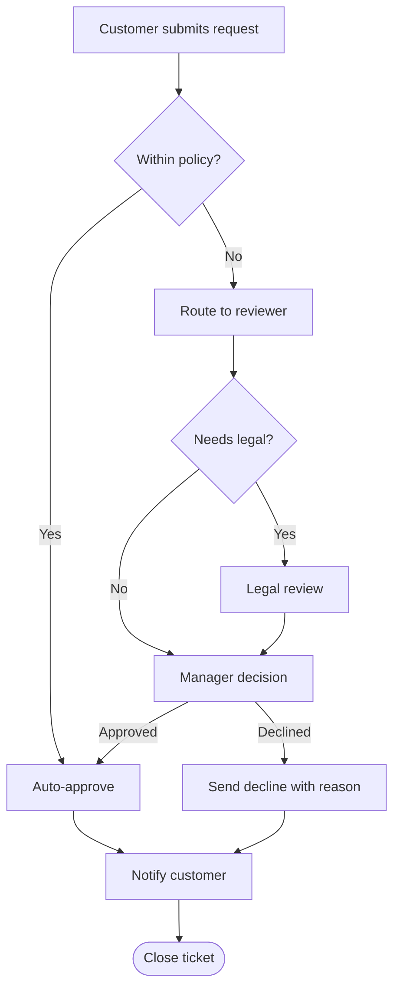
```mermaid
flowchart TD
  A[Customer submits request] --> B{Within policy?}
  B -->|Yes| C[Auto-approve]
  B -->|No| D[Route to reviewer]
  D --> E{Needs legal?}
  E -->|Yes| F[Legal review]
  E -->|No| G[Manager decision]
  F --> G
  G -->|Approved| C
  G -->|Declined| H[Send decline with reason]
  C --> I[Notify customer]
  H --> I
  I --> J([Close ticket])
```

### Sequence diagram

Source: prose or a list describing who sends what to whom, in order: an integration, a support escalation, an approval exchange between people or systems.

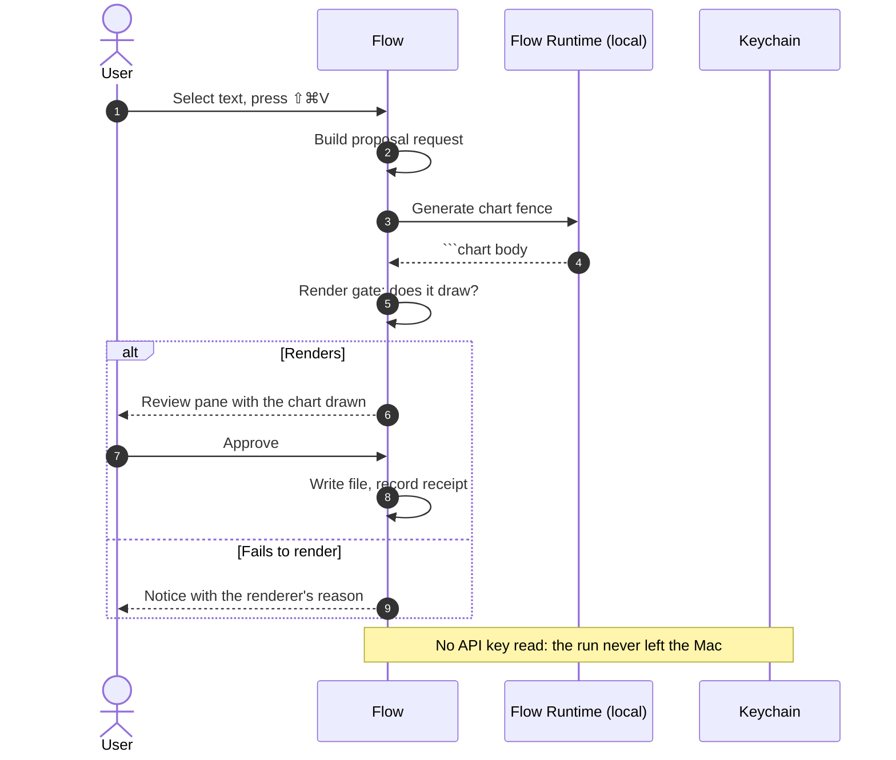
```mermaid
sequenceDiagram
  autonumber
  actor U as User
  participant F as Flow
  participant R as Flow Runtime (local)
  participant K as Keychain
  U->>F: Select text, press ⇧⌘V
  F->>F: Build proposal request
  F->>R: Generate chart fence
  R-->>F: ```chart body
  F->>F: Render gate: does it draw?
  alt Renders
    F-->>U: Review pane with the chart drawn
    U->>F: Approve
    F->>F: Write file, record receipt
  else Fails to render
    F-->>U: Notice with the renderer's reason
  end
  Note over F,K: No API key read: the run never left the Mac
```

### State diagram

Source: a list of states and the events that move between them: a document lifecycle, an order status, a subscription.

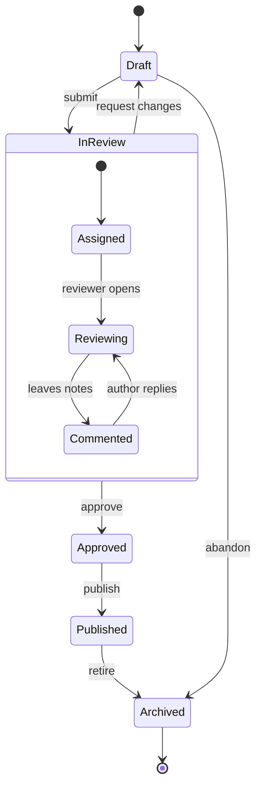
```mermaid
stateDiagram-v2
  [*] --> Draft
  Draft --> InReview: submit
  InReview --> Draft: request changes
  InReview --> Approved: approve
  Approved --> Published: publish
  Published --> Archived: retire
  Draft --> Archived: abandon
  Archived --> [*]
  state InReview {
    [*] --> Assigned
    Assigned --> Reviewing: reviewer opens
    Reviewing --> Commented: leaves notes
    Commented --> Reviewing: author replies
  }
```

### Class diagram

Source: a description of the nouns in a system and how they relate: the data model behind a product, with fields and one-to-many relationships.

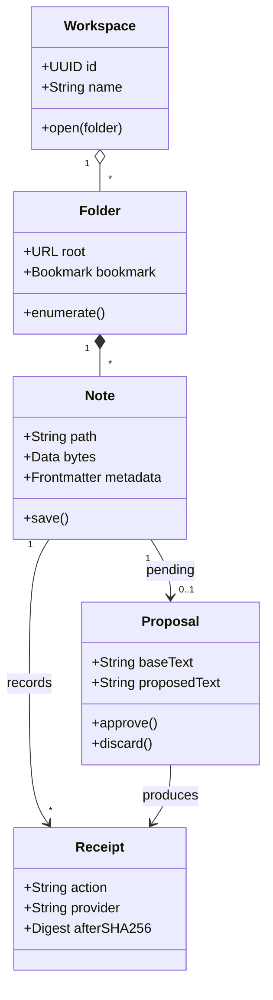
```mermaid
classDiagram
  class Workspace {
    +UUID id
    +String name
    +open(folder)
  }
  class Folder {
    +URL root
    +Bookmark bookmark
    +enumerate()
  }
  class Note {
    +String path
    +Data bytes
    +Frontmatter metadata
    +save()
  }
  class Receipt {
    +String action
    +String provider
    +Digest afterSHA256
  }
  class Proposal {
    +String baseText
    +String proposedText
    +approve()
    +discard()
  }
  Workspace "1" o-- "*" Folder
  Folder "1" *-- "*" Note
  Note "1" --> "*" Receipt : records
  Note "1" --> "0..1" Proposal : pending
  Proposal --> Receipt : produces
```

### Entity-relationship diagram

Source: a list of tables with their keys and how rows reference one another: a database schema, or a CRM's objects.

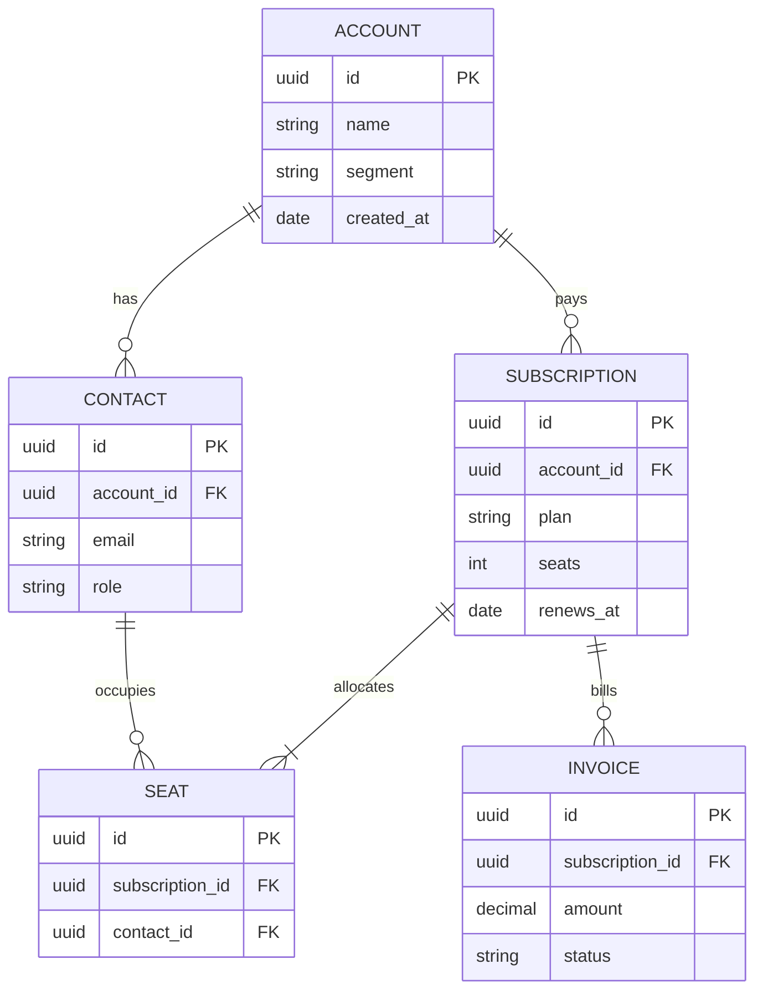
```mermaid
erDiagram
  ACCOUNT ||--o{ CONTACT : has
  ACCOUNT ||--o{ SUBSCRIPTION : pays
  SUBSCRIPTION ||--|{ SEAT : allocates
  CONTACT ||--o{ SEAT : occupies
  SUBSCRIPTION ||--o{ INVOICE : bills
  ACCOUNT {
    uuid id PK
    string name
    string segment
    date created_at
  }
  CONTACT {
    uuid id PK
    uuid account_id FK
    string email
    string role
  }
  SUBSCRIPTION {
    uuid id PK
    uuid account_id FK
    string plan
    int seats
    date renews_at
  }
  SEAT {
    uuid id PK
    uuid subscription_id FK
    uuid contact_id FK
  }
  INVOICE {
    uuid id PK
    uuid subscription_id FK
    decimal amount
    string status
  }
```

### Gantt (Mermaid)

Source: a list of tasks with durations and dependencies, in sections: a project plan written as prose, when you want milestones and "after X" dependencies rather than fixed dates.

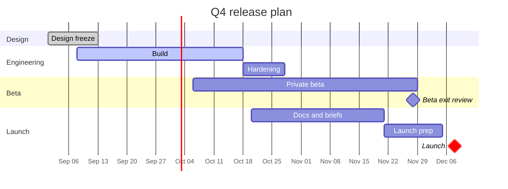
```mermaid
gantt
  title Q4 release plan
  dateFormat YYYY-MM-DD
  axisFormat %b %d
  section Design
    Design freeze          :done, des, 2026-09-01, 12d
  section Engineering
    Build                  :active, build, 2026-09-08, 40d
    Hardening              :hard, after build, 10d
  section Beta
    Private beta           :beta, 2026-10-06, 54d
    Beta exit review       :milestone, m1, 2026-11-28, 0d
  section Launch
    Docs and briefs        :docs, 2026-10-20, 32d
    Launch prep            :prep, after docs, 14d
    Launch                 :crit, milestone, 2026-12-08, 0d
```

### User journey

Source: a walkthrough of what a person does, step by step, with how each step felt: research synthesis, a support transcript, an onboarding review.

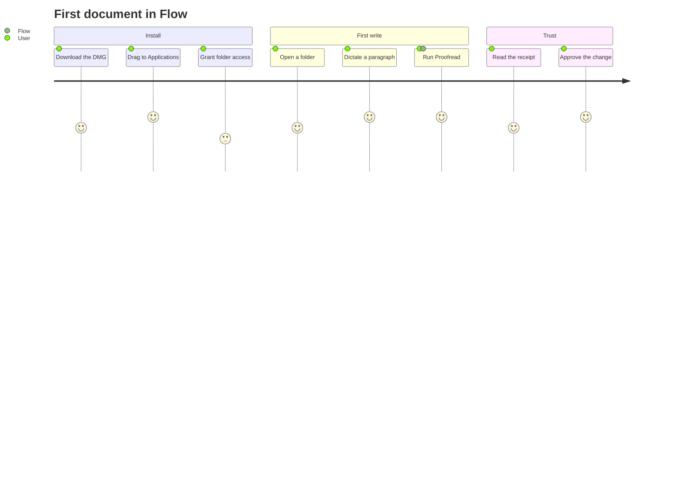
```mermaid
journey
  title First document in Flow
  section Install
    Download the DMG: 4: User
    Drag to Applications: 5: User
    Grant folder access: 3: User
  section First write
    Open a folder: 4: User
    Dictate a paragraph: 5: User
    Run Proofread: 5: User, Flow
  section Trust
    Read the receipt: 4: User
    Approve the change: 5: User
```

### Pie (Mermaid)

Source: a short list of labels and amounts: the same material as a chart pie, when you want it inside a diagram-only document or rendered on GitHub.

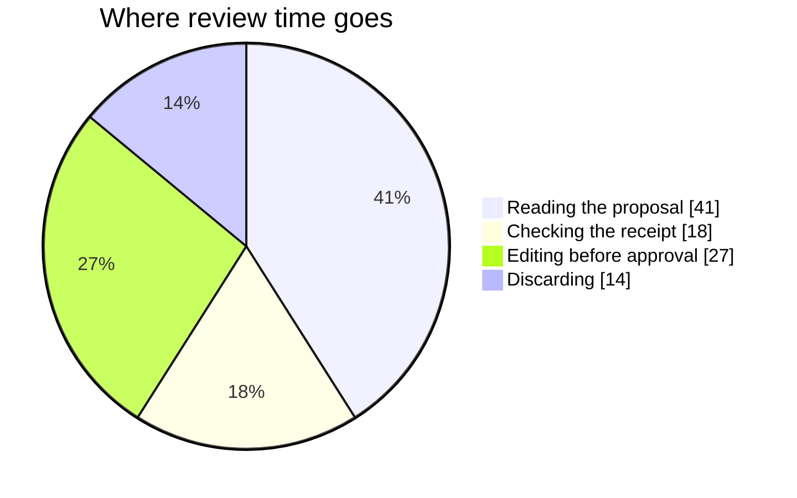
```mermaid
pie showData
  title Where review time goes
  "Reading the proposal" : 41
  "Checking the receipt" : 18
  "Editing before approval" : 27
  "Discarding" : 14
```

### Quadrant chart

Source: a list of items each rated on two axes, such as effort and impact, risk and reward or urgency and importance, the prioritisation matrix.

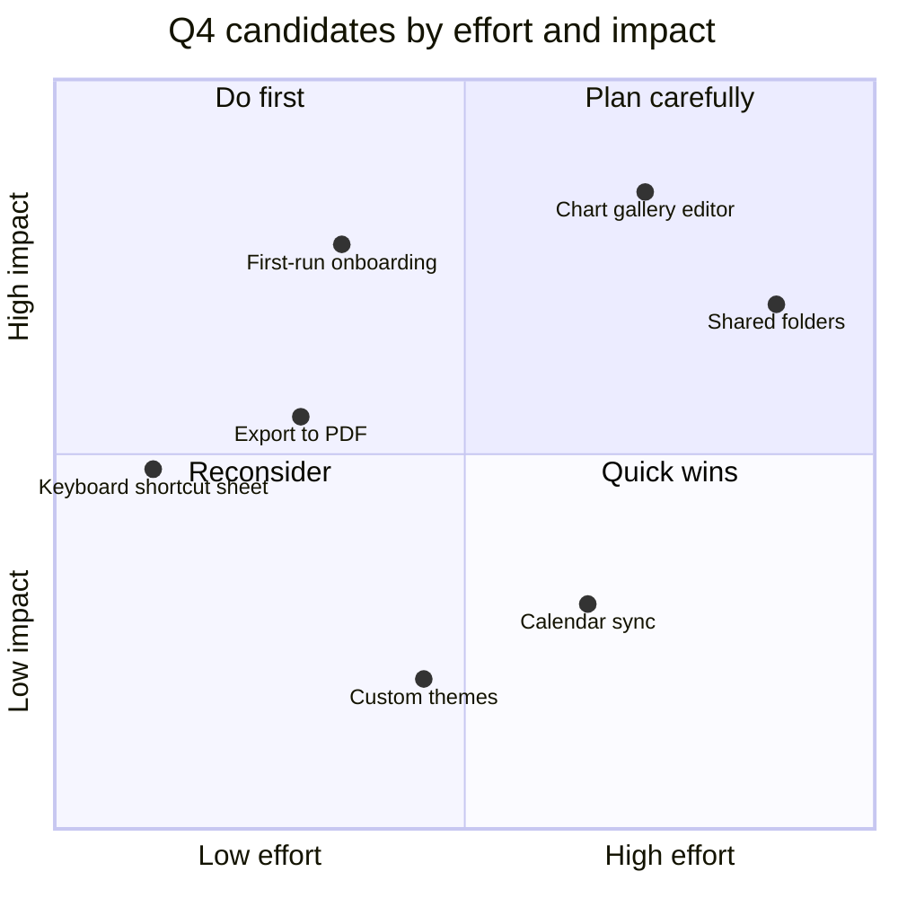
```mermaid
quadrantChart
  title Q4 candidates by effort and impact
  x-axis Low effort --> High effort
  y-axis Low impact --> High impact
  quadrant-1 Plan carefully
  quadrant-2 Do first
  quadrant-3 Reconsider
  quadrant-4 Quick wins
  Chart gallery editor: [0.72, 0.85]
  First-run onboarding: [0.35, 0.78]
  Shared folders: [0.88, 0.70]
  Export to PDF: [0.30, 0.55]
  Custom themes: [0.45, 0.20]
  Calendar sync: [0.65, 0.30]
  Keyboard shortcut sheet: [0.12, 0.48]
```

### Timeline

Source: a list of dated events: a company history, a release log, an incident's sequence.

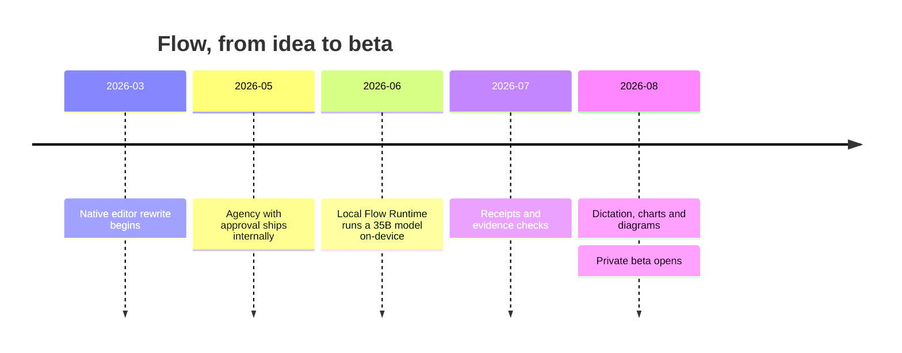
```mermaid
timeline
  title Flow, from idea to beta
  2026-03 : Native editor rewrite begins
  2026-05 : Agency with approval ships internally
  2026-06 : Local Flow Runtime runs a 35B model on-device
  2026-07 : Receipts and evidence checks
  2026-08 : Dictation, charts and diagrams
         : Private beta opens
```

### Mindmap

Source: an outline, a nested bulleted list of topics and subtopics, such as meeting notes, a brainstorm, or a document's structure.

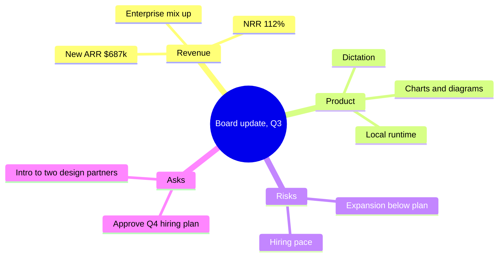
```mermaid
mindmap
  root((Board update, Q3))
    Revenue
      New ARR $687k
      NRR 112%
      Enterprise mix up
    Product
      Dictation
      Charts and diagrams
      Local runtime
    Risks
      Expansion below plan
      Hiring pace
    Asks
      Approve Q4 hiring plan
      Intro to two design partners
```

### Git graph

Source: a description of branches, merges and releases: a release process, or how a feature landed.

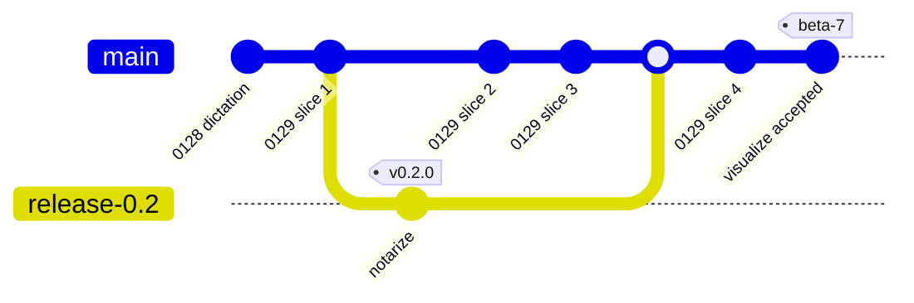
```mermaid
gitGraph
  commit id: "0128 dictation"
  commit id: "0129 slice 1"
  branch release-0.2
  checkout release-0.2
  commit id: "notarize" tag: "v0.2.0"
  checkout main
  commit id: "0129 slice 2"
  commit id: "0129 slice 3"
  merge release-0.2
  commit id: "0129 slice 4"
  commit id: "visualize accepted" tag: "beta-7"
```

### Sankey diagram

Source: a table of source, target and amount: where traffic, money or people flow from one stage to the next, such as a funnel or an energy balance.

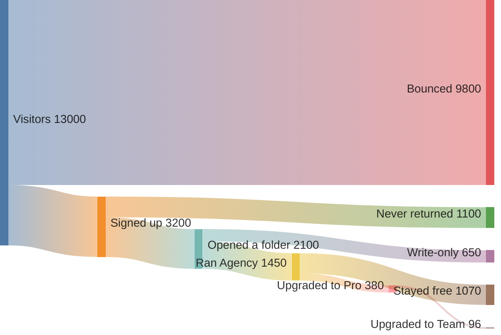
```mermaid
sankey-beta
Visitors,Signed up,3200
Visitors,Bounced,9800
Signed up,Opened a folder,2100
Signed up,Never returned,1100
Opened a folder,Ran Agency,1450
Opened a folder,Write-only,650
Ran Agency,Upgraded to Pro,380
Ran Agency,Stayed free,1070
Upgraded to Pro,Upgraded to Team,96
```

### XY chart (Mermaid)

Source: a date-and-value table when the document must render on GitHub as well as in Flow: a bar-plus-line over months without the chart fence.

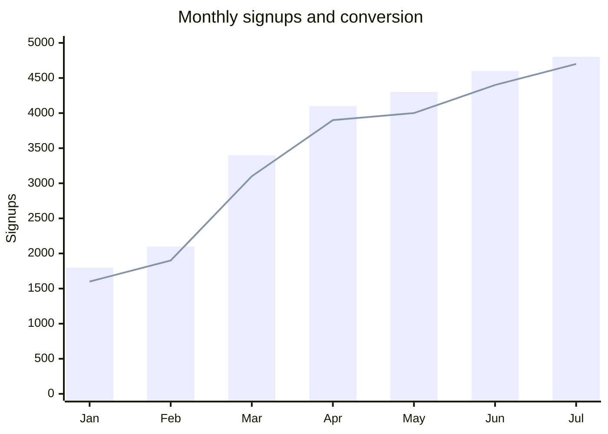
```mermaid
xychart-beta
  title "Monthly signups and conversion"
  x-axis [Jan, Feb, Mar, Apr, May, Jun, Jul]
  y-axis "Signups" 0 --> 5000
  bar [1800, 2100, 3400, 4100, 4300, 4600, 4800]
  line [1600, 1900, 3100, 3900, 4000, 4400, 4700]
```

### Block diagram

Source: a description of components and how they sit beside and connect to each other: an architecture sketch, a deployment layout.

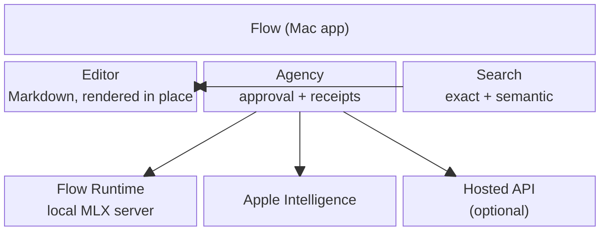
```mermaid
block-beta
  columns 3
  App["Flow (Mac app)"]:3
  Editor["Editor\nMarkdown, rendered in place"] Agency["Agency\napproval + receipts"] Search["Search\nexact + semantic"]
  space:3
  Runtime["Flow Runtime\nlocal MLX server"] Apple["Apple Intelligence"] Hosted["Hosted API\n(optional)"]
  Agency --> Runtime
  Agency --> Apple
  Agency --> Hosted
  Editor --> Agency
  Search --> Editor
```

### Requirement diagram

Source: a list of requirements with identifiers, risk and verification method, and which components satisfy them: a compliance or safety document.

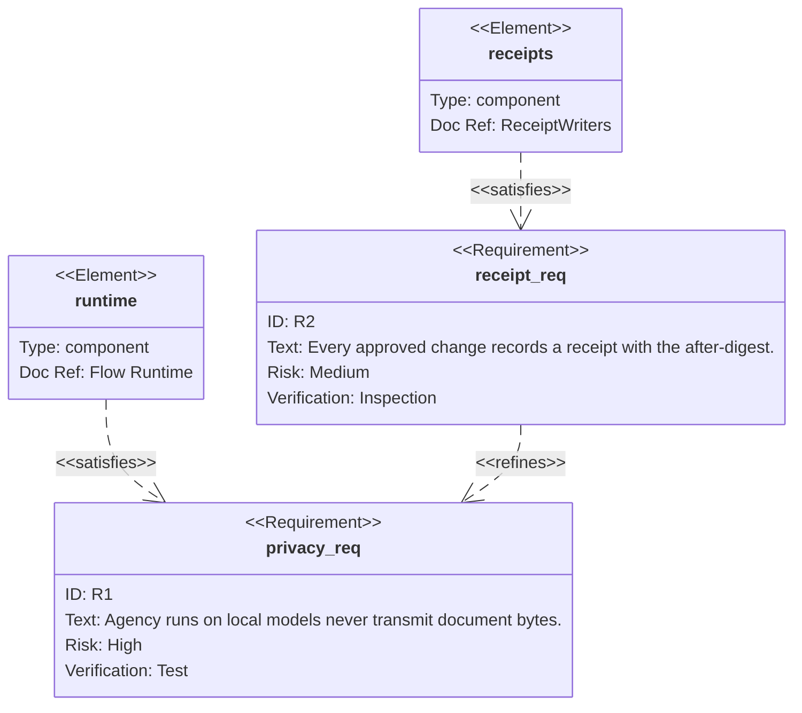
```mermaid
requirementDiagram
  requirement privacy_req {
    id: R1
    text: "Agency runs on local models never transmit document bytes."
    risk: high
    verifymethod: test
  }
  requirement receipt_req {
    id: R2
    text: "Every approved change records a receipt with the after-digest."
    risk: medium
    verifymethod: inspection
  }
  element runtime {
    type: component
    docref: Flow Runtime
  }
  element receipts {
    type: component
    docref: ReceiptWriters
  }
  runtime - satisfies -> privacy_req
  receipts - satisfies -> receipt_req
  receipt_req - refines -> privacy_req
```

### C4 context diagram

Source: a paragraph naming the system, the people who use it, and the external systems it talks to: the top of an architecture document.

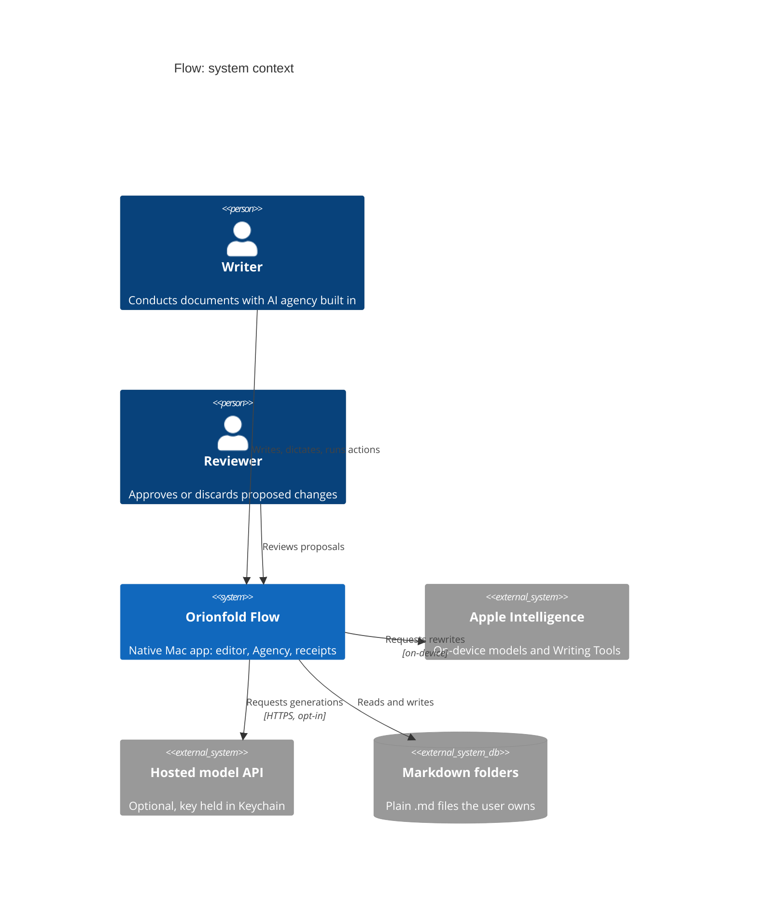
```mermaid
C4Context
  title Flow: system context
  Person(writer, "Writer", "Conducts documents with AI agency built in")
  Person(reviewer, "Reviewer", "Approves or discards proposed changes")
  System(flow, "Orionfold Flow", "Native Mac app: editor, Agency, receipts")
  System_Ext(apple, "Apple Intelligence", "On-device models and Writing Tools")
  System_Ext(hosted, "Hosted model API", "Optional, key held in Keychain")
  SystemDb_Ext(vault, "Markdown folders", "Plain .md files the user owns")
  Rel(writer, flow, "Writes, dictates, runs actions")
  Rel(reviewer, flow, "Reviews proposals")
  Rel(flow, apple, "Requests rewrites", "on-device")
  Rel(flow, hosted, "Requests generations", "HTTPS, opt-in")
  Rel(flow, vault, "Reads and writes")
```

### Kanban board

Source: a task list grouped by status: the sprint board as columns of cards with owners.

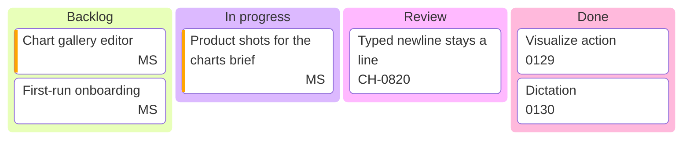
```mermaid
kanban
  Backlog
    gallery[Chart gallery editor]@{ assigned: 'MS', priority: 'High' }
    onboard[First-run onboarding]@{ assigned: 'MS' }
  In progress
    shots[Product shots for the charts brief]@{ assigned: 'MS', priority: 'High' }
  Review
    newline[Typed newline stays a line]@{ ticket: 'CH-0820' }
  Done
    visualize[Visualize action]@{ ticket: '0129' }
    dictate[Dictation]@{ ticket: '0130' }
```

### Architecture diagram

Source: a list of services, the stores they use and the edges between them, grouped by where they run: a deployment diagram.

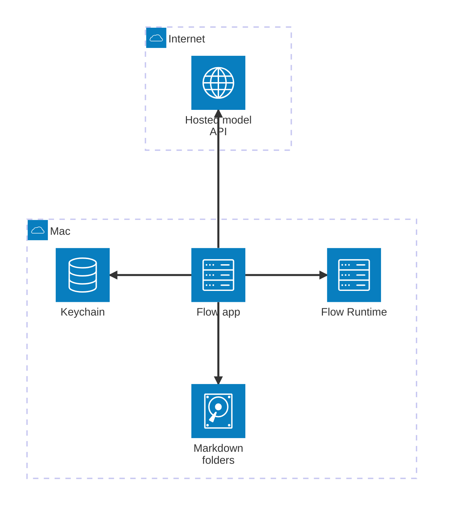
```mermaid
architecture-beta
  group mac(cloud)[Mac]
  service app(server)[Flow app] in mac
  service runtime(server)[Flow Runtime] in mac
  service disk(disk)[Markdown folders] in mac
  service keychain(database)[Keychain] in mac
  group cloud(cloud)[Internet]
  service api(internet)[Hosted model API] in cloud
  app:R --> L:runtime
  app:B --> T:disk
  app:L --> R:keychain
  app:T --> B:api
```

### Packet diagram

Source: a field-by-field layout of a binary record or header, with bit offsets: a protocol note or a file-format spec.

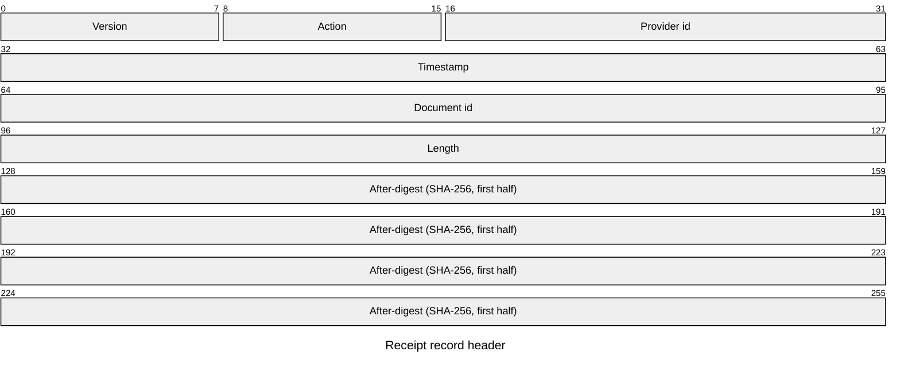
```mermaid
packet-beta
  title Receipt record header
  0-7: "Version"
  8-15: "Action"
  16-31: "Provider id"
  32-63: "Timestamp"
  64-95: "Document id"
  96-127: "Length"
  128-255: "After-digest (SHA-256, first half)"
```
