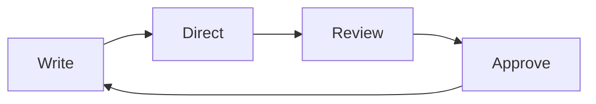

# The reference card

Everything else in this folder is a document that happens to use Flow. This one is a reference, because some things genuinely are reference and pretending otherwise would make the other seven worse.

## Text you can write

Flow reads GitHub-Flavored Markdown. Nothing here is Flow-private syntax: open any of these documents in another editor and they render the same.

*Emphasis*, **strong**, `inline code`, and [links](https://orionfold.com). Line breaks hold where you put them.

- Bullet lists
- With nested items
  - Like this one
- [ ] And task lists
- [x] With state that persists

1. Ordered lists
2. Numbered from wherever you start
3. Renumbering as you edit

> Block quotes, for the words that are not yours.

***

Horizontal rules, for when a section genuinely ends.

## Tables

| Construct | Renders | Editable in place |
| :--- | :---: | ---: |
| Tables | yes | yes |
| Charts | yes | yes |
| Diagrams | yes | yes |
| Images | yes | alt text |

Alignment comes from the delimiter row: `:---`, `:---:`, `---:`. Cells take arbitrary Markdown, so **bold**, `code` and [links](https://orionfold.com) all work inside them. Richness comes from what you can put in a cell, not from a schema around the table.

## Charts

A chart is a fenced block with `chart` as its language, a `chartType`, and data. Thirty-four types ship. Edit the numbers and the chart redraws.

```chart
chartType: Donut Chart
title: Where the quarter's revenue came from
data:
  - {segment: Enterprise, amount: 141}
  - {segment: Self-serve, amount: 49}
semantic_types: {segment: Category, amount: Quantity}
encodings:
  size: {field: amount}
  color: {field: segment}
```

## Diagrams

Mermaid diagrams work the same way, in a `mermaid` fence:



## Code

Fenced code keeps its language and is highlighted, not rendered:

```swift
func total(_ lines: [Line]) -> Decimal {
    lines.reduce(0) { $0 + $1.amount }
}
```

## Images


Images live beside your documents in `assets/`, as ordinary files.

## Linking documents

Wrap a document's name in double brackets to link to it. That is how [[Welcome]] indexes this one, and how every document in this folder points at [[Quarterly Business Review]]. Backlinks are shown at the foot of each document, so you can see what points at what.

Footnotes work too.[^note]

[^note]: Like this. The definition can sit anywhere; it renders at the end.

## Front matter

Every document here opens with a YAML block carrying `title` and `tags`. It is ordinary authorship, not a Flow feature, and other editors read it too. One key is Flow's: a `jobs:` list makes the document a living document the Night Shift works on overnight. [[Night Shift]] explains it, and the six folders in this Guide are complete examples.

## What Flow deliberately does not render

Callout blocks, math, highlight spans, comment spans, embedded documents, and links that point at a heading inside another document. These are not supported in this build, so no document in this folder uses one. A Guide that showed you a broken construct on first launch would be worse than one that stayed quiet about it.

## What leaves your Mac

Flow is built so that nothing has to leave this Mac, which makes the list of times it reaches the network short enough to print. As of Flow 1.5.6, this is all of it, and every line is something you started, can switch off, or whose outcome you control:

| When | Where | What is sent | Your switch |
| --- | --- | --- | --- |
| Flow looks for a new version: at launch, then at most once every six hours | orionfold.com | The request for the update list, carrying Flow's version and the updater's name, as any web request does | Flow ▸ Check for Updates… runs it by hand |
| You press Flow Guide Updates… | github.com (the Guide's public home) | A request for the Guide's index, then only the documents you accept | Only when you press it |
| You press Buy Flow Pro or Manage Plan… in Settings ▸ Billing | orionfold.supabase.co (Orionfold's billing service) | The plan and seat count you chose, or your licence file so the server can answer for it | Only when you press it |
| You run a model through Ollama or LM Studio on this Mac | This Mac | Your prompt and the text you selected, when you approve a run | Settings ▸ Models ▸ On this Mac, one switch; a runtime pointed at another machine is refused |
| You add a cloud provider's key | That provider | Your prompt and the text you selected, when you approve a run; the meter shows it first | Settings ▸ Models ▸ Cloud, the key is the switch; remove the key and it is off |
| You refresh a provider's price list, or first set up OpenRouter | openrouter.ai | A request for public prices; nothing about you | Only when you ask |
| You import a model | huggingface.co | The download request for the model you chose | Only when you press it |
| A document embeds an image by web address | That address | The request for the image, when the document is shown | Write the image into the folder instead, and nothing is fetched |
| You open a web address in a pane | That address | What any browser sends to load a page | Only when you enter one |
| A run looks something up on the web, with web lookups on | The address the model chose | The request for that page, as any web request does, not your document, though the address is chosen from what it says | Settings ▸ General ▸ Web Lookups, off until you turn it on |

That is the whole list. As of Flow 1.5.6, Flow keeps no usage statistics, sends no crash reports, carries no analytics or advertising code, has no install identifier, and never checks a licence online to keep working. If a future Flow offers to share counts or crash reports with Orionfold, it will be a switch that starts off, and this table will list it beside the others.

Need to tell us about a problem? Help ▸ Copy Diagnostics… puts a short block on the clipboard: the Flow and macOS versions, the kind of Mac, which domains are on, and the last crash's summary if there is one, with no paths, titles, or names in it. You see the exact text before it is copied, and it goes nowhere until you paste it.

## Dictation

Dictation writes into any editor, and speech never leaves this Mac. Whether a spoken word is punctuation or a word is decided by the speech model from what surrounds it, so "stop" is sometimes the word and sometimes a full stop; Flow has no setting for that. The switches in Settings ▸ Documents apply to the next dictation you start.

## Where things live

| Thing | Where |
| --- | --- |
| This folder | Settings ▸ General ▸ Flow Guide |
| Your other folders | Add Folder in the sidebar |
| Models and providers | Settings ▸ Models |
| What a run cost | The meter, before you approve |
