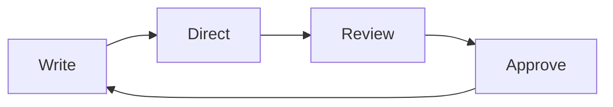

# The reference card

Everything else in this folder is a document that happens to use Flow. This one
is a reference, because some things genuinely are reference and pretending
otherwise would make the other seven worse.

## Text you can write

Flow reads GitHub-Flavored Markdown. Nothing here is Flow-private syntax — open
any of these documents in another editor and they render the same.

*Emphasis*, **strong**, `inline code`, and [links](https://orionfold.com).
Line breaks hold where you put them.

- Bullet lists
- With nested items
  - Like this one
- [ ] And task lists
- [x] With state that persists

1. Ordered lists
2. Numbered from wherever you start
3. Renumbering as you edit

> Block quotes, for the words that are not yours.

***

Horizontal rules, for when a section genuinely ends.

## Tables

| Construct | Renders | Editable in place |
| :--- | :---: | ---: |
| Tables | yes | yes |
| Charts | yes | yes |
| Diagrams | yes | yes |
| Images | yes | alt text |

Alignment comes from the delimiter row — `:---`, `:---:`, `---:`. Cells take
arbitrary Markdown, so **bold**, `code` and [links](https://orionfold.com) all
work inside them. Richness comes from what you can put in a cell, not from a
schema around the table.

## Charts

A chart is a fenced block with `chart` as its language, a `chartType`, and
data. Thirty-four types ship. Edit the numbers and the chart redraws.

```chart
chartType: Donut Chart
title: Where the quarter's revenue came from
data:
  - {segment: Enterprise, amount: 141}
  - {segment: Self-serve, amount: 49}
semantic_types: {segment: Category, amount: Quantity}
encodings:
  size: {field: amount}
  color: {field: segment}
```

## Diagrams

Mermaid diagrams work the same way, in a `mermaid` fence:



## Code

Fenced code keeps its language and is highlighted, not rendered:

```swift
func total(_ lines: [Line]) -> Decimal {
    lines.reduce(0) { $0 + $1.amount }
}
```

## Images


Images live beside your documents in `assets/`, as ordinary files.

## Linking documents

Wrap a document's name in double brackets to link to it — that is how
[[Welcome]] indexes this one, and how every document in this folder points at
[[Quarterly Business Review]]. Backlinks are shown at the foot of each
document, so you can see what points at what.

Footnotes work too.[^note]

[^note]: Like this. The definition can sit anywhere; it renders at the end.

## Front matter

Every document here opens with a YAML block carrying `title` and `tags`. It is
ordinary authorship, not a Flow feature — other editors read it too.

## What Flow deliberately does not render

Callout blocks, math, highlight spans, comment spans, embedded documents, and
links that point at a heading inside another document. These are not supported
in this build, so no document in this folder uses one — a Guide that showed you
a broken construct on first launch would be worse than one that stayed quiet
about it.

## Where things live

| Thing | Where |
| --- | --- |
| This folder | Settings ▸ Flow System ▸ Flow Guide |
| Your other folders | Add Folder in the sidebar |
| Models and providers | Settings ▸ Models |
| What a run cost | The meter, before you approve |
